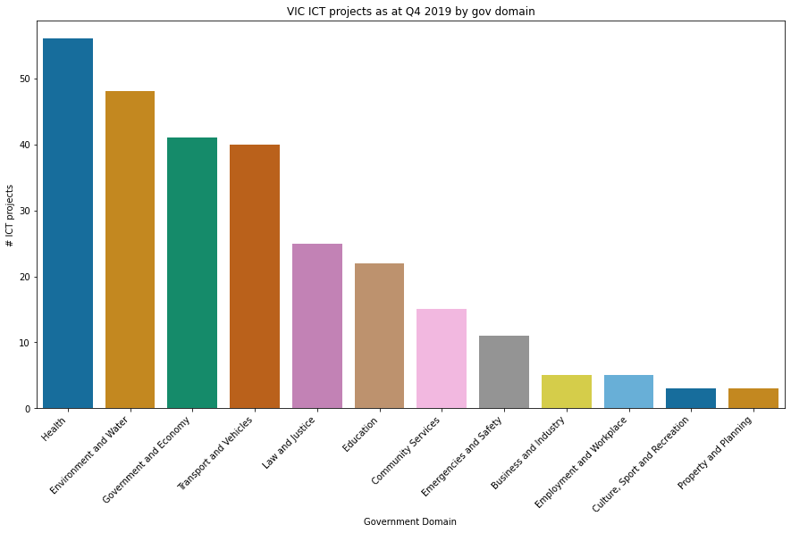
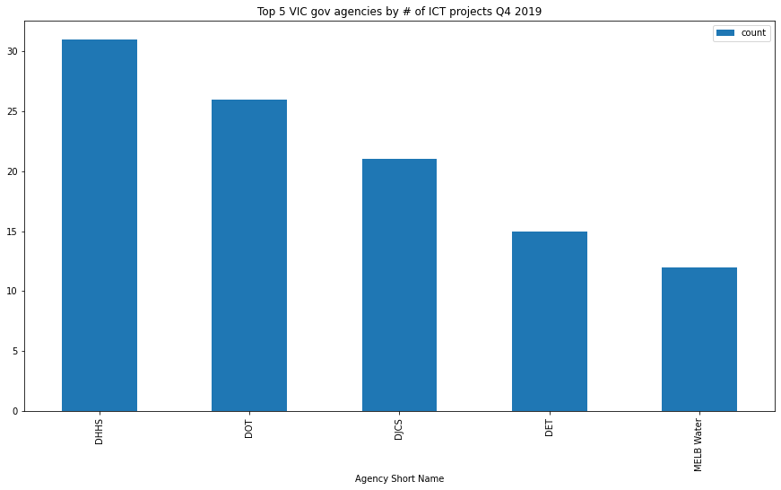
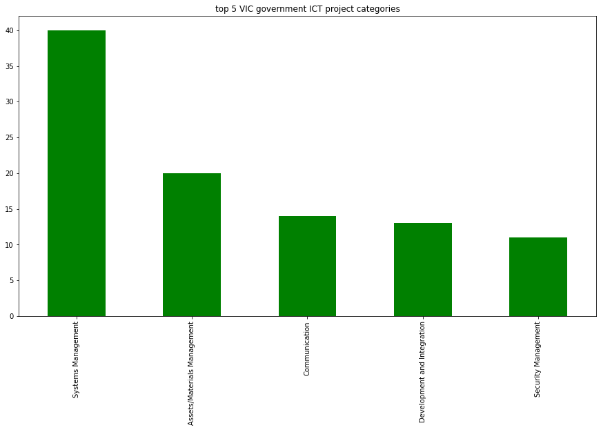
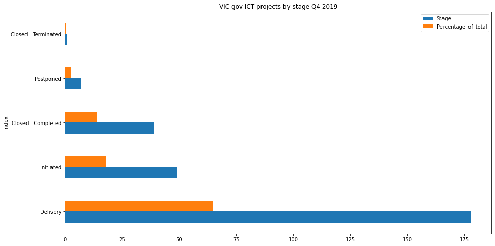
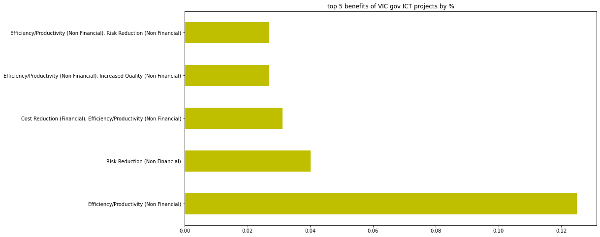
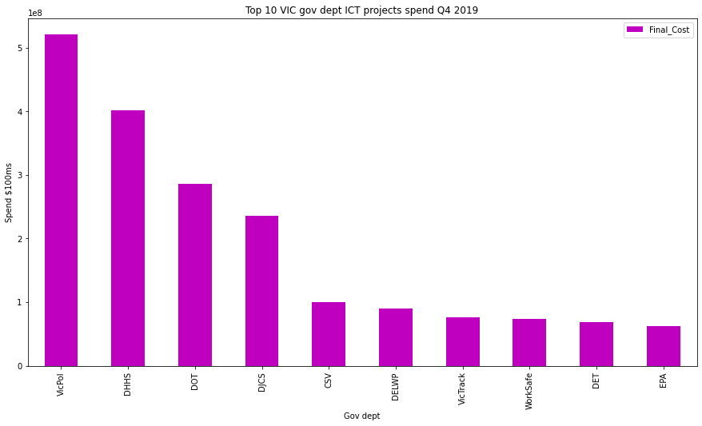
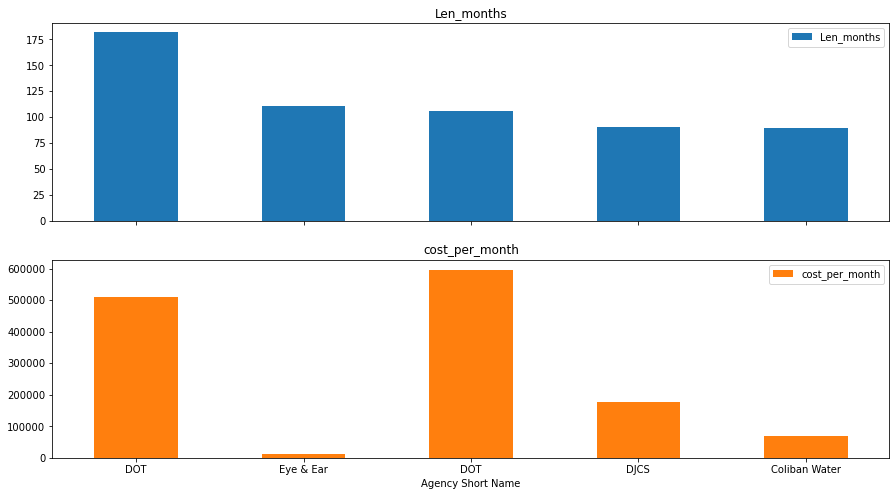
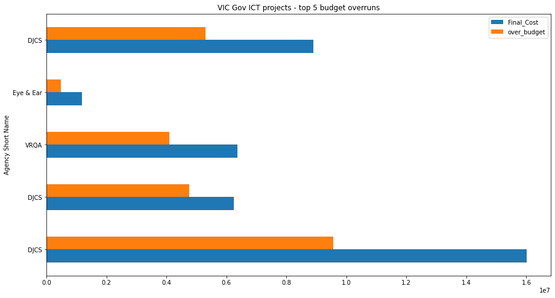

# Cleaning data, exploratory data analysis & visualisation

## 1. The data

For this project, I analysed the Victorian government's ICT dashboard which provides information on Victorian Government projects that have an ICT expenditure of $1M or more. 

The public dataset can be found here:https://discover.data.vic.gov.au/dataset/ict-expenditure-dashboard.

Information and communications technology (ICT) is integral to how governments manage information and deliver programs and services. Comprehensive reporting of ICT expenditure and projects is important to improve transparency and provide assurance that public sector agencies have used public resources in an efficient, effective and economic way.

The 69 government agencies included in the ICT Dashboard have reported on +270 projects with a combined value of around $2.2 billion.

## 2. Importing an excel file into pandas 


```python
#upload excel file as data frame

import pandas as pd
df = pd.read_excel('consolidated-data-qtr-4-2019-20.xlsx')
```


```python
#view top 5 rows of the table to get a better idea of the data
```


```python
df.head()
```


<div>
<style scoped>
    .dataframe tbody tr th:only-of-type {
        vertical-align: middle;
    }

    .dataframe tbody tr th {
        vertical-align: top;
    }

    .dataframe thead th {
        text-align: right;
    }
</style>
<table border="1" class="dataframe">
  <thead>
    <tr style="text-align: right;">
      <th></th>
      <th>Collection Period</th>
      <th>Department/\nAgency Name</th>
      <th>Agency Short Name</th>
      <th>Project ID</th>
      <th>Project Title</th>
      <th>Government Domain</th>
      <th>ICT Project Category</th>
      <th>Description</th>
      <th>Stage</th>
      <th>Benefit Category  ( Benefit Type)</th>
      <th>...</th>
      <th>Planned Delivery End Date</th>
      <th>Revised Delivery End Date</th>
      <th>Planned Delivery Cost</th>
      <th>Revised Delivery Cost</th>
      <th>Q4 18-19</th>
      <th>Q1 19-20</th>
      <th>Q2 19-20</th>
      <th>Q3 19-20</th>
      <th>Q4 19-20 (Current)</th>
      <th>Reporting  Comments</th>
    </tr>
  </thead>
  <tbody>
    <tr>
      <th>0</th>
      <td>Q4 19-20</td>
      <td>Country Fire Authority</td>
      <td>CFA</td>
      <td>2151</td>
      <td>CFA Short Status Messaging (SSM)</td>
      <td>Emergencies and Safety</td>
      <td>Communication</td>
      <td>Provide a Short Status Messaging system to all...</td>
      <td>Initiated</td>
      <td>NaN</td>
      <td>...</td>
      <td>NaT</td>
      <td>NaT</td>
      <td>NaN</td>
      <td>NaN</td>
      <td>NaN</td>
      <td>NaN</td>
      <td>NaN</td>
      <td>NaN</td>
      <td>NaN</td>
      <td>Project scope and timelines have been reviewed...</td>
    </tr>
    <tr>
      <th>1</th>
      <td>Q4 19-20</td>
      <td>Department of Justice and Community Safety</td>
      <td>DJCS</td>
      <td>2152</td>
      <td>Regional Radio Command Service</td>
      <td>Emergencies and Safety</td>
      <td>Communication</td>
      <td>Establish new command and control level voice ...</td>
      <td>Closed - Terminated</td>
      <td>NaN</td>
      <td>...</td>
      <td>2017-06-30</td>
      <td>NaT</td>
      <td>5000000.0</td>
      <td>0.0</td>
      <td>NaN</td>
      <td>NaN</td>
      <td>NaN</td>
      <td>NaN</td>
      <td>NaN</td>
      <td>The project has been closed as no funding sour...</td>
    </tr>
    <tr>
      <th>2</th>
      <td>Q4 19-20</td>
      <td>Chisholm Institute of TAFE</td>
      <td>Chisholm TAFE</td>
      <td>2153</td>
      <td>Customer Relationship Management Implementation</td>
      <td>Education</td>
      <td>Customer Relationship Management</td>
      <td>To provide an improved service to existing and...</td>
      <td>Delivery</td>
      <td>Cost Reduction (Financial), Customer Satisfact...</td>
      <td>...</td>
      <td>2018-03-31</td>
      <td>2020-07-31</td>
      <td>3083074.0</td>
      <td>3733696.0</td>
      <td>Amber</td>
      <td>Green</td>
      <td>Green</td>
      <td>Green</td>
      <td>Green</td>
      <td>Remaining scope of the project is to complete ...</td>
    </tr>
    <tr>
      <th>3</th>
      <td>Q4 19-20</td>
      <td>Department of Health and Human Services</td>
      <td>DHHS</td>
      <td>2166</td>
      <td>Melton Community Based Ambulatory Care Centre ...</td>
      <td>Health</td>
      <td>Organisational Management</td>
      <td>Implementation of the ICT integration solution...</td>
      <td>Postponed</td>
      <td>Increased Quality (Non Financial)</td>
      <td>...</td>
      <td>2018-12-17</td>
      <td>2020-06-30</td>
      <td>1187640.0</td>
      <td>1410661.0</td>
      <td>Green</td>
      <td>Green</td>
      <td>Green</td>
      <td>Amber</td>
      <td>Green</td>
      <td>The project is reviewing funding availability ...</td>
    </tr>
    <tr>
      <th>4</th>
      <td>Q4 19-20</td>
      <td>Department of Education and Training</td>
      <td>DET</td>
      <td>2169</td>
      <td>International Student Information Management S...</td>
      <td>Education</td>
      <td>Management of Process</td>
      <td>The project will replace the legacy informatio...</td>
      <td>Delivery</td>
      <td>Compliance (Non Financial), Cost Avoidance (Fi...</td>
      <td>...</td>
      <td>2017-12-08</td>
      <td>2020-10-23</td>
      <td>905000.0</td>
      <td>3509658.0</td>
      <td>Amber</td>
      <td>Red</td>
      <td>Red</td>
      <td>Green</td>
      <td>Green</td>
      <td>This project is critical to DET and without IS...</td>
    </tr>
  </tbody>
</table>
<p>5 rows × 30 columns</p>
</div>


```python
#inspect the DF's basic info to check for missing values, data types, columns we may want to drop.
```


```python
df.info()
```

    <class 'pandas.core.frame.DataFrame'>
    RangeIndex: 274 entries, 0 to 273
    Data columns (total 30 columns):
     #   Column                             Non-Null Count  Dtype         
    ---  ------                             --------------  -----         
     0   Collection Period                  274 non-null    object        
     1   Department/
    Agency Name            274 non-null    object        
     2   Agency Short Name                  274 non-null    object        
     3   Project ID                         274 non-null    int64         
     4   Project Title                      274 non-null    object        
     5   Government Domain                  274 non-null    object        
     6   ICT Project Category               274 non-null    object        
     7   Description                        274 non-null    object        
     8   Stage                              274 non-null    object        
     9   Benefit Category  ( Benefit Type)  224 non-null    object        
     10  Date of Closure/ Postponement      47 non-null     datetime64[ns]
     11  PM Methodologies                   274 non-null    object        
     12  Initiation Start Date              274 non-null    datetime64[ns]
     13  Planned Initiation End Date        274 non-null    datetime64[ns]
     14  Revised Initiation End Date        89 non-null     datetime64[ns]
     15  Business Case Approval Date        228 non-null    datetime64[ns]
     16  Planned Initiation Cost            273 non-null    float64       
     17  Revised initiation Cost            70 non-null     float64       
     18  Planned Delivery Start Date        222 non-null    datetime64[ns]
     19  Revised Delivery Start Date        16 non-null     datetime64[ns]
     20  Planned Delivery End Date          223 non-null    datetime64[ns]
     21  Revised Delivery End Date          135 non-null    datetime64[ns]
     22  Planned Delivery Cost              225 non-null    float64       
     23  Revised Delivery Cost              134 non-null    float64       
     24  Q4 18-19                           114 non-null    object        
     25  Q1 19-20                           139 non-null    object        
     26  Q2 19-20                           175 non-null    object        
     27  Q3 19-20                           196 non-null    object        
     28  Q4 19-20 (Current)                 222 non-null    object        
     29  Reporting  Comments                274 non-null    object        
    dtypes: datetime64[ns](9), float64(4), int64(1), object(16)
    memory usage: 64.3+ KB


## 3. Basic data cleaning & sorting


```python
#drop columns that are not needed for the analysis (by column index number) & check columns have been dropped by number of columns at end of operation.

df.drop(df.columns[[24,25,26,27,28,29]], axis=1, inplace=True) 
```


```python
df
```


<div>
<style scoped>
    .dataframe tbody tr th:only-of-type {
        vertical-align: middle;
    }

    .dataframe tbody tr th {
        vertical-align: top;
    }

    .dataframe thead th {
        text-align: right;
    }
</style>
<table border="1" class="dataframe">
  <thead>
    <tr style="text-align: right;">
      <th></th>
      <th>Collection Period</th>
      <th>Department/\nAgency Name</th>
      <th>Agency Short Name</th>
      <th>Project ID</th>
      <th>Project Title</th>
      <th>Government Domain</th>
      <th>ICT Project Category</th>
      <th>Description</th>
      <th>Stage</th>
      <th>Benefit Category  ( Benefit Type)</th>
      <th>...</th>
      <th>Revised Initiation End Date</th>
      <th>Business Case Approval Date</th>
      <th>Planned Initiation Cost</th>
      <th>Revised initiation Cost</th>
      <th>Planned Delivery Start Date</th>
      <th>Revised Delivery Start Date</th>
      <th>Planned Delivery End Date</th>
      <th>Revised Delivery End Date</th>
      <th>Planned Delivery Cost</th>
      <th>Revised Delivery Cost</th>
    </tr>
  </thead>
  <tbody>
    <tr>
      <th>0</th>
      <td>Q4 19-20</td>
      <td>Country Fire Authority</td>
      <td>CFA</td>
      <td>2151</td>
      <td>CFA Short Status Messaging (SSM)</td>
      <td>Emergencies and Safety</td>
      <td>Communication</td>
      <td>Provide a Short Status Messaging system to all...</td>
      <td>Initiated</td>
      <td>NaN</td>
      <td>...</td>
      <td>2020-06-30</td>
      <td>NaT</td>
      <td>0.0</td>
      <td>45000.0</td>
      <td>NaT</td>
      <td>NaT</td>
      <td>NaT</td>
      <td>NaT</td>
      <td>NaN</td>
      <td>NaN</td>
    </tr>
    <tr>
      <th>1</th>
      <td>Q4 19-20</td>
      <td>Department of Justice and Community Safety</td>
      <td>DJCS</td>
      <td>2152</td>
      <td>Regional Radio Command Service</td>
      <td>Emergencies and Safety</td>
      <td>Communication</td>
      <td>Establish new command and control level voice ...</td>
      <td>Closed - Terminated</td>
      <td>NaN</td>
      <td>...</td>
      <td>NaT</td>
      <td>2016-06-30</td>
      <td>8000000.0</td>
      <td>NaN</td>
      <td>NaT</td>
      <td>NaT</td>
      <td>2017-06-30</td>
      <td>NaT</td>
      <td>5000000.0</td>
      <td>0.0</td>
    </tr>
    <tr>
      <th>2</th>
      <td>Q4 19-20</td>
      <td>Chisholm Institute of TAFE</td>
      <td>Chisholm TAFE</td>
      <td>2153</td>
      <td>Customer Relationship Management Implementation</td>
      <td>Education</td>
      <td>Customer Relationship Management</td>
      <td>To provide an improved service to existing and...</td>
      <td>Delivery</td>
      <td>Cost Reduction (Financial), Customer Satisfact...</td>
      <td>...</td>
      <td>NaT</td>
      <td>2017-05-07</td>
      <td>418304.0</td>
      <td>NaN</td>
      <td>2017-05-07</td>
      <td>NaT</td>
      <td>2018-03-31</td>
      <td>2020-07-31</td>
      <td>3083074.0</td>
      <td>3733696.0</td>
    </tr>
    <tr>
      <th>3</th>
      <td>Q4 19-20</td>
      <td>Department of Health and Human Services</td>
      <td>DHHS</td>
      <td>2166</td>
      <td>Melton Community Based Ambulatory Care Centre ...</td>
      <td>Health</td>
      <td>Organisational Management</td>
      <td>Implementation of the ICT integration solution...</td>
      <td>Postponed</td>
      <td>Increased Quality (Non Financial)</td>
      <td>...</td>
      <td>NaT</td>
      <td>2017-11-30</td>
      <td>223020.0</td>
      <td>NaN</td>
      <td>2018-01-01</td>
      <td>NaT</td>
      <td>2018-12-17</td>
      <td>2020-06-30</td>
      <td>1187640.0</td>
      <td>1410661.0</td>
    </tr>
    <tr>
      <th>4</th>
      <td>Q4 19-20</td>
      <td>Department of Education and Training</td>
      <td>DET</td>
      <td>2169</td>
      <td>International Student Information Management S...</td>
      <td>Education</td>
      <td>Management of Process</td>
      <td>The project will replace the legacy informatio...</td>
      <td>Delivery</td>
      <td>Compliance (Non Financial), Cost Avoidance (Fi...</td>
      <td>...</td>
      <td>NaT</td>
      <td>2016-05-31</td>
      <td>201000.0</td>
      <td>NaN</td>
      <td>2016-05-31</td>
      <td>NaT</td>
      <td>2017-12-08</td>
      <td>2020-10-23</td>
      <td>905000.0</td>
      <td>3509658.0</td>
    </tr>
    <tr>
      <th>...</th>
      <td>...</td>
      <td>...</td>
      <td>...</td>
      <td>...</td>
      <td>...</td>
      <td>...</td>
      <td>...</td>
      <td>...</td>
      <td>...</td>
      <td>...</td>
      <td>...</td>
      <td>...</td>
      <td>...</td>
      <td>...</td>
      <td>...</td>
      <td>...</td>
      <td>...</td>
      <td>...</td>
      <td>...</td>
      <td>...</td>
      <td>...</td>
    </tr>
    <tr>
      <th>269</th>
      <td>Q4 19-20</td>
      <td>CenITex</td>
      <td>CenITex</td>
      <td>3010</td>
      <td>Network Access Control as a Service</td>
      <td>Government and Economy</td>
      <td>Assets/Materials Management</td>
      <td>Request funding to implement a Network Access ...</td>
      <td>Initiated</td>
      <td>NaN</td>
      <td>...</td>
      <td>NaT</td>
      <td>NaT</td>
      <td>2499429.0</td>
      <td>NaN</td>
      <td>NaT</td>
      <td>NaT</td>
      <td>NaT</td>
      <td>NaT</td>
      <td>NaN</td>
      <td>NaN</td>
    </tr>
    <tr>
      <th>270</th>
      <td>Q4 19-20</td>
      <td>Department of Jobs, Precincts and Regions</td>
      <td>DJPR</td>
      <td>3011</td>
      <td>Website Redevelopment Project</td>
      <td>Government and Economy</td>
      <td>Communication,Content Management</td>
      <td>Deliver a fit for purpose, accessible, externa...</td>
      <td>Delivery</td>
      <td>Compliance (Non Financial), Customer Satisfact...</td>
      <td>...</td>
      <td>NaT</td>
      <td>2019-08-18</td>
      <td>180000.0</td>
      <td>187894.0</td>
      <td>2019-08-18</td>
      <td>NaT</td>
      <td>2020-08-31</td>
      <td>NaT</td>
      <td>898858.0</td>
      <td>NaN</td>
    </tr>
    <tr>
      <th>271</th>
      <td>Q4 19-20</td>
      <td>South East Water</td>
      <td>SE Water</td>
      <td>3015</td>
      <td>Corporate Website Project</td>
      <td>Environment and Water</td>
      <td>Content Management</td>
      <td>The public South East Water website is on a te...</td>
      <td>Delivery</td>
      <td>Cost Reduction (Financial), Customer Satisfact...</td>
      <td>...</td>
      <td>NaT</td>
      <td>2020-04-12</td>
      <td>50000.0</td>
      <td>NaN</td>
      <td>2020-04-12</td>
      <td>NaT</td>
      <td>2020-11-27</td>
      <td>NaT</td>
      <td>1138589.0</td>
      <td>NaN</td>
    </tr>
    <tr>
      <th>272</th>
      <td>Q4 19-20</td>
      <td>South East Water</td>
      <td>SE Water</td>
      <td>3016</td>
      <td>Salesforce Classic to Lightning</td>
      <td>Environment and Water</td>
      <td>Customer Relationship Management</td>
      <td>Salesforce Classic is a legacy platform that i...</td>
      <td>Initiated</td>
      <td>NaN</td>
      <td>...</td>
      <td>NaT</td>
      <td>NaT</td>
      <td>65000.0</td>
      <td>NaN</td>
      <td>NaT</td>
      <td>NaT</td>
      <td>NaT</td>
      <td>NaT</td>
      <td>NaN</td>
      <td>NaN</td>
    </tr>
    <tr>
      <th>273</th>
      <td>Q4 19-20</td>
      <td>Victorian Managed Insurance Authority</td>
      <td>VMIA</td>
      <td>3017</td>
      <td>Client360 Release 2</td>
      <td>Government and Economy</td>
      <td>Tracking and Workflow</td>
      <td>To deliver on Strategy 2024 objectives VMIA re...</td>
      <td>Initiated</td>
      <td>NaN</td>
      <td>...</td>
      <td>NaT</td>
      <td>NaT</td>
      <td>0.0</td>
      <td>NaN</td>
      <td>NaT</td>
      <td>NaT</td>
      <td>NaT</td>
      <td>NaT</td>
      <td>NaN</td>
      <td>NaN</td>
    </tr>
  </tbody>
</table>
<p>274 rows × 24 columns</p>
</div>


## 4.  Visualising key data insights in seaborn

Let's explore Which government domain had the most ICT projects as at Q4 2019? 


```python
# Visualise the data by isolating the relevant column ("Government Domain") & plot its distribution (using seaborn).

import seaborn as sns
import matplotlib.pyplot as plt

sns.set_style = 'whitegrid'

#set figure size
fig,ax = plt.subplots(figsize=(15,8)) 

#Set the seaborn colourblind palette - this palette is one of the seaborn 'Qualittative Palettes' which are best suited for categorical

sns.countplot(ax=ax, data=df, x= 'Government Domain', palette='colorblind', order = df['Government Domain'].value_counts().index)

#Rotate the x-axis labels so they don't overlap (here done to 45 degrees).

plt.xticks(rotation=45, horizontalalignment = 'right')

#Set y-axis label and plot title.

plt.title('VIC ICT projects as at Q4 2019 by gov domain')

plt.ylabel('# ICT projects')

plt.show()

```





As we can see above, the VIC government Health domain has the highest number of technology projects, closely followed by the Environment & Water domain. 

Interestingly, the Employment, Business & Industry, Property & Planning domains have had the least number of technology projects.

The Emergencies & Safety government domain has also had one of the lowest number of ICT projects.

Next, let's explore who were the top 5 government agencies with the largest number of ICT projects.


```python
#create a subset of the table with only gov agencies and unique projects, group by agency and count how many projects are listed for each agency
grouped_df = df[['Agency Short Name','Project ID']].groupby(['Agency Short Name']).agg(['count']).reset_index()

#display the grouped dataframe
print(grouped_df)

#sort values by number of projects counted (high to low)
grouped_df.sort_values(by=[('Project ID', 'count')], ascending=False,inplace=True)

#display the top 5 gov agencies by number of projects
grouped_df=grouped_df.head(5)

#validate results
print(grouped_df)

grouped_df.info()
```

       Agency Short Name Project ID
                              count
    0               ACMI          1
    1             ALFRED          2
    2                AVS          6
    3           BKI TAFE          1
    4           BR Water          2
    ..               ...        ...
    64                WH          4
    65         WPR Water          1
    66          WR Water          1
    67          WorkSafe         11
    68          YV Water          7
    
    [69 rows x 2 columns]
       Agency Short Name Project ID
                              count
    13              DHHS         31
    17               DOT         26
    15              DJCS         21
    12               DET         15
    32        MELB Water         12
    <class 'pandas.core.frame.DataFrame'>
    Int64Index: 5 entries, 13 to 32
    Data columns (total 2 columns):
     #   Column                 Non-Null Count  Dtype 
    ---  ------                 --------------  ----- 
     0   (Agency Short Name, )  5 non-null      object
     1   (Project ID, count)    5 non-null      int64 
    dtypes: int64(1), object(1)
    memory usage: 120.0+ bytes


```python
#plot results
grouped_df.plot.bar(x='Agency Short Name', y='Project ID', figsize=(15,8), title='Top 5 VIC gov agencies by # of ICT projects Q4 2019')
```


    <matplotlib.axes._subplots.AxesSubplot at 0x11ca03970>





Looks like out of 69 government departments and agencies reflected in the dataset, the Department of Health and Human Services has had the largest number of ICT projects (31), followed by Department of Transport (26), Department of Justice and Community Safety (21), Department of Education and Training (15) and Melbourne Water (12). 

## 5. Further exploration of the data by project categories & stages 


```python
#how many projects are in the dataset

df['Project ID'].nunique()
```


    274


```python
#how many unique gov departments and agencies are represented in the dataset

df['Agency Short Name'].nunique()
```


    69


```python
#how many unique project categories appear in the data

print(df['ICT Project Category'].nunique())
```

    122


We'd only want to focus on the most popular categories so let's see what they are.


```python
#Check which categories appear most frequently

df['ICT Project Category'].value_counts()
```


    Systems Management                                                                                                            40
    Assets/Materials Management                                                                                                   20
    Communication                                                                                                                 14
    Development and Integration                                                                                                   13
    Security Management                                                                                                           11
                                                                                                                                  ..
    Development and Integration ,Management of Process ,Organisational Management                                                  1
    Collaboration  ,Communication,Data Management,Knowledge Discovery ,Management of Process ,Reporting ,Tracking and Workflow     1
    Business Intelligence                                                                                                          1
    Data Management,Knowledge Management ,Management of Process ,Records Management ,Tracking and Workflow,Visualisation           1
    Development and Integration ,Management of Process ,Tracking and Workflow                                                      1
    Name: ICT Project Category, Length: 122, dtype: int64


It looks like the top 5 categories across this column are: systems management, assets management, development and integration and security management. 
    
We can now double check that we've got the highest occurring categories by using the nlargest() function (as you'll see below, this summary looks neater and clearer).


```python
#Show most popular project categories

categories=df['ICT Project Category'].value_counts().nlargest()
categories
```


    Systems Management             40
    Assets/Materials Management    20
    Communication                  14
    Development and Integration    13
    Security Management            11
    Name: ICT Project Category, dtype: int64


It would also be useful to explore the least popular project categories by using the nsmallest() function:


```python
#Show the least popular project categories

df['ICT Project Category'].value_counts().nsmallest()
```


    Customer Relationship Management,Data Management,Development and Integration ,Reporting      1
    Development and Integration ,Systems Management                                              1
    Financial Management,Supply Chain Management                                                 1
    Analyses and Statistics ,Assets/Materials Management,Systems Management,Communication        1
    Content Management,Forms Management,Knowledge Discovery ,Reporting ,Tracking and Workflow    1
    Name: ICT Project Category, dtype: int64


```python
#visualise most popular project category types

categories.plot.bar(figsize=(15,8), title='top 5 VIC government ICT project categories', color='g')
```


    <matplotlib.axes._subplots.AxesSubplot at 0x11d3ae130>





Out of 122 project categories, it looks like the top 5 types of ICT projects carried out by the VIC government are systems management, assets management, communication, development and integration and security management. 

Also interesting to see that there's only been 1 of each project involving CRMs, data management, financial and supply chain management software and data analysis (content management, forms management, knowledge discovery, reporting, tracking and workflow).

Next, let's explore the status of projects. It would be useful to see how many projects are completed and how many still ongoing.

First, let's check how many unique values are in the "Stage" column.


```python
#how many unique stages have we got in the dataset
df['Stage'].nunique()
```


    5


```python
#how many projects are there per stage
stages=df['Stage'].value_counts().reset_index()

#display the stages and number of projects
stages
```


<div>
<style scoped>
    .dataframe tbody tr th:only-of-type {
        vertical-align: middle;
    }

    .dataframe tbody tr th {
        vertical-align: top;
    }

    .dataframe thead th {
        text-align: right;
    }
</style>
<table border="1" class="dataframe">
  <thead>
    <tr style="text-align: right;">
      <th></th>
      <th>index</th>
      <th>Stage</th>
    </tr>
  </thead>
  <tbody>
    <tr>
      <th>0</th>
      <td>Delivery</td>
      <td>178</td>
    </tr>
    <tr>
      <th>1</th>
      <td>Initiated</td>
      <td>49</td>
    </tr>
    <tr>
      <th>2</th>
      <td>Closed - Completed</td>
      <td>39</td>
    </tr>
    <tr>
      <th>3</th>
      <td>Postponed</td>
      <td>7</td>
    </tr>
    <tr>
      <th>4</th>
      <td>Closed - Terminated</td>
      <td>1</td>
    </tr>
  </tbody>
</table>
</div>


```python
#add a column that calculates the % of total for each stage
stages['Percentage_of_total']=(stages['Stage']/274)*100
stages
```


<div>
<style scoped>
    .dataframe tbody tr th:only-of-type {
        vertical-align: middle;
    }

    .dataframe tbody tr th {
        vertical-align: top;
    }

    .dataframe thead th {
        text-align: right;
    }
</style>
<table border="1" class="dataframe">
  <thead>
    <tr style="text-align: right;">
      <th></th>
      <th>index</th>
      <th>Stage</th>
      <th>Percentage_of_total</th>
    </tr>
  </thead>
  <tbody>
    <tr>
      <th>0</th>
      <td>Delivery</td>
      <td>178</td>
      <td>64.963504</td>
    </tr>
    <tr>
      <th>1</th>
      <td>Initiated</td>
      <td>49</td>
      <td>17.883212</td>
    </tr>
    <tr>
      <th>2</th>
      <td>Closed - Completed</td>
      <td>39</td>
      <td>14.233577</td>
    </tr>
    <tr>
      <th>3</th>
      <td>Postponed</td>
      <td>7</td>
      <td>2.554745</td>
    </tr>
    <tr>
      <th>4</th>
      <td>Closed - Terminated</td>
      <td>1</td>
      <td>0.364964</td>
    </tr>
  </tbody>
</table>
</div>


```python
stages.plot.barh(figsize=(15,8), x='index', title="VIC gov ICT projects by stage Q4 2019")
```


    <matplotlib.axes._subplots.AxesSubplot at 0x11e5936a0>





Insights - Over 83% of projects are still ongoing with 65% in the delivery stage and 18% initiated. 

Less than 15% of projects have been completed and around 3% of projects are postponed. 

A small percentage (0.3%) have been closed prior to completion.

We can also explore the "Benefit Category" in the table to see which are the most common benefit categories for ICT projects (ie this will help us understand what is the most common reason for undertaking ICT projects).


```python
#display how many unique benefit categories are in the dataset 
df['Benefit Category  ( Benefit Type)'].nunique()
```


    107


```python
#count the frequency of each benefit category as a percentage of the total and display the top 5 
benefit_df=df['Benefit Category  ( Benefit Type)'].value_counts(sort=True, ascending=False, normalize=True)

benefit_df=benefit_df.head()
benefit_df
```


    Efficiency/Productivity (Non Financial)                                       0.125000
    Risk Reduction (Non Financial)                                                0.040179
    Cost Reduction (Financial), Efficiency/Productivity (Non Financial)           0.031250
    Efficiency/Productivity (Non Financial), Increased Quality (Non Financial)    0.026786
    Efficiency/Productivity (Non Financial), Risk Reduction (Non Financial)       0.026786
    Name: Benefit Category  ( Benefit Type), dtype: float64


It looks like increasing "efficiency and productivity" is the most cited benefit of ICT projects undertaken by VIC gov departments and this benefit is mentioned for 12% of ICT projects in VIC. This is followed by "risk reduction" (4% of projects) and "cost reduction" (3% of projects).


```python
benefit_df.plot.barh(figsize=(15,8), color='y', title='top 5 benefits of VIC gov ICT projects by %')
```


    <matplotlib.axes._subplots.AxesSubplot at 0x11f973430>





## 6. Exploring cost data across projects and gov departments

It would also be interesting to explore what ICT projects cost in total and which gov departments have the highest value projects.

If we look at the original file, we can see that cost is set out across 2 separate columns per project: 'Planned Delivery Cost' and 'Revised Delivery Cost' - this indicates that the originally forecast cost was later updated, for some (not all) projects. 

We can examine this further by looking at the df.info() summary above, where there are only 134 non-null records in the "revised cost column" out of a total of 274 records/projects in this table. This tells us that costs have been revised for 48% of projects.

We'll assume that where the 'revised' cost column shows a null/NaN value, the project's cost has not been updated as it remains accurate. 

To asses the actual total costs across all projects, we'd need to combine these two columns into one "final cost" column and do some data cleaning and reshaping before we can analyse the cost data. Here's what that looks like in code: 


```python
#Create a new "final cost" column with all NaN values in it to house the new cost data

import numpy as np
df['Final_Cost'] = np.NaN

#Using the fillna() function, replace the above NaN values with 'Revised Delivery Cost', or, if that's NaN, with 'Planned Delivery Cost'

df['Final_Cost'] = df['Revised Delivery Cost'].fillna(df['Planned Delivery Cost'])

```


```python
#Check data type of the new column to ensure it is numeric

df['Final_Cost'].dtypes
```


    dtype('float64')


```python
#check if anu null values still exist in this column

df['Final_Cost'].isnull().values.any()

```


    True


```python
#Check which records still have null values

df['Final_Cost'].isnull()
```


    0       True
    1      False
    2      False
    3      False
    4      False
           ...  
    269     True
    270    False
    271    False
    272     True
    273     True
    Name: Final_Cost, Length: 274, dtype: bool


```python
#Check how many null values still appear in the new column
df['Final_Cost'].isnull().sum()
```


    49


```python
#Check which records in the new column have NaN values
print(df.Final_Cost)
```

    0            NaN
    1            0.0
    2      3733696.0
    3      1410661.0
    4      3509658.0
             ...    
    269          NaN
    270     898858.0
    271    1138589.0
    272          NaN
    273          NaN
    Name: Final_Cost, Length: 274, dtype: float64


```python
#Look up two of the above Nan records to check the reason for NaN values still appearing. 

print(df.iloc[272:274])
```

        Collection Period               Department/\nAgency Name  \
    272          Q4 19-20                       South East Water   
    273          Q4 19-20  Victorian Managed Insurance Authority   
    
        Agency Short Name  Project ID                    Project Title  \
    272          SE Water        3016  Salesforce Classic to Lightning   
    273              VMIA        3017              Client360 Release 2   
    
              Government Domain              ICT Project Category  \
    272   Environment and Water  Customer Relationship Management   
    273  Government and Economy             Tracking and Workflow   
    
                                               Description      Stage  \
    272  Salesforce Classic is a legacy platform that i...  Initiated   
    273  To deliver on Strategy 2024 objectives VMIA re...  Initiated   
    
        Benefit Category  ( Benefit Type)  ... Business Case Approval Date  \
    272                               NaN  ...                         NaT   
    273                               NaN  ...                         NaT   
    
        Planned Initiation Cost Revised initiation Cost  \
    272                 65000.0                     NaN   
    273                     0.0                     NaN   
    
        Planned Delivery Start Date Revised Delivery Start Date  \
    272                         NaT                         NaT   
    273                         NaT                         NaT   
    
        Planned Delivery End Date  Revised Delivery End Date  \
    272                       NaT                        NaT   
    273                       NaT                        NaT   
    
         Planned Delivery Cost Revised Delivery Cost Final_Cost  
    272                    NaN                   NaN        NaN  
    273                    NaN                   NaN        NaN  
    
    [2 rows x 25 columns]


Looks like the reason for NaN values still appearing in the Final_Cost column is that both 'planned' and 'revised' costs are NaN is some rows, hence the final cost column also shows 'NaN'.


```python
#Check the number of NaN values in each of the two 'base' columns is equal to confirm the above hypothesis.

df['Revised Delivery Cost'].isnull().sum()

df['Planned Delivery Cost'].isnull().sum()
```


    49


```python
#Drop NaN values from Final Cost column to clean up the data and enable further analysis.

df.dropna(subset=['Final_Cost'])
```


<div>
<style scoped>
    .dataframe tbody tr th:only-of-type {
        vertical-align: middle;
    }

    .dataframe tbody tr th {
        vertical-align: top;
    }

    .dataframe thead th {
        text-align: right;
    }
</style>
<table border="1" class="dataframe">
  <thead>
    <tr style="text-align: right;">
      <th></th>
      <th>Collection Period</th>
      <th>Department/\nAgency Name</th>
      <th>Agency Short Name</th>
      <th>Project ID</th>
      <th>Project Title</th>
      <th>Government Domain</th>
      <th>ICT Project Category</th>
      <th>Description</th>
      <th>Stage</th>
      <th>Benefit Category  ( Benefit Type)</th>
      <th>...</th>
      <th>Revised Delivery End Date</th>
      <th>Planned Delivery Cost</th>
      <th>Revised Delivery Cost</th>
      <th>Q4 18-19</th>
      <th>Q1 19-20</th>
      <th>Q2 19-20</th>
      <th>Q3 19-20</th>
      <th>Q4 19-20 (Current)</th>
      <th>Reporting  Comments</th>
      <th>Final_Cost</th>
    </tr>
  </thead>
  <tbody>
    <tr>
      <th>1</th>
      <td>Q4 19-20</td>
      <td>Department of Justice and Community Safety</td>
      <td>DJCS</td>
      <td>2152</td>
      <td>Regional Radio Command Service</td>
      <td>Emergencies and Safety</td>
      <td>Communication</td>
      <td>Establish new command and control level voice ...</td>
      <td>Closed - Terminated</td>
      <td>NaN</td>
      <td>...</td>
      <td>NaT</td>
      <td>5000000.0</td>
      <td>0.0</td>
      <td>NaN</td>
      <td>NaN</td>
      <td>NaN</td>
      <td>NaN</td>
      <td>NaN</td>
      <td>The project has been closed as no funding sour...</td>
      <td>0.0</td>
    </tr>
    <tr>
      <th>2</th>
      <td>Q4 19-20</td>
      <td>Chisholm Institute of TAFE</td>
      <td>Chisholm TAFE</td>
      <td>2153</td>
      <td>Customer Relationship Management Implementation</td>
      <td>Education</td>
      <td>Customer Relationship Management</td>
      <td>To provide an improved service to existing and...</td>
      <td>Delivery</td>
      <td>Cost Reduction (Financial), Customer Satisfact...</td>
      <td>...</td>
      <td>2020-07-31</td>
      <td>3083074.0</td>
      <td>3733696.0</td>
      <td>Amber</td>
      <td>Green</td>
      <td>Green</td>
      <td>Green</td>
      <td>Green</td>
      <td>Remaining scope of the project is to complete ...</td>
      <td>3733696.0</td>
    </tr>
    <tr>
      <th>3</th>
      <td>Q4 19-20</td>
      <td>Department of Health and Human Services</td>
      <td>DHHS</td>
      <td>2166</td>
      <td>Melton Community Based Ambulatory Care Centre ...</td>
      <td>Health</td>
      <td>Organisational Management</td>
      <td>Implementation of the ICT integration solution...</td>
      <td>Postponed</td>
      <td>Increased Quality (Non Financial)</td>
      <td>...</td>
      <td>2020-06-30</td>
      <td>1187640.0</td>
      <td>1410661.0</td>
      <td>Green</td>
      <td>Green</td>
      <td>Green</td>
      <td>Amber</td>
      <td>Green</td>
      <td>The project is reviewing funding availability ...</td>
      <td>1410661.0</td>
    </tr>
    <tr>
      <th>4</th>
      <td>Q4 19-20</td>
      <td>Department of Education and Training</td>
      <td>DET</td>
      <td>2169</td>
      <td>International Student Information Management S...</td>
      <td>Education</td>
      <td>Management of Process</td>
      <td>The project will replace the legacy informatio...</td>
      <td>Delivery</td>
      <td>Compliance (Non Financial), Cost Avoidance (Fi...</td>
      <td>...</td>
      <td>2020-10-23</td>
      <td>905000.0</td>
      <td>3509658.0</td>
      <td>Amber</td>
      <td>Red</td>
      <td>Red</td>
      <td>Green</td>
      <td>Green</td>
      <td>This project is critical to DET and without IS...</td>
      <td>3509658.0</td>
    </tr>
    <tr>
      <th>5</th>
      <td>Q4 19-20</td>
      <td>Department of Health and Human Services</td>
      <td>DHHS</td>
      <td>2184</td>
      <td>Real-time prescription monitoring system</td>
      <td>Health</td>
      <td>Data Management</td>
      <td>Implement software that transmits prescription...</td>
      <td>Closed - Completed</td>
      <td>Compliance (Non Financial), Cost Avoidance (Fi...</td>
      <td>...</td>
      <td>NaT</td>
      <td>21227000.0</td>
      <td>11123520.0</td>
      <td>Green</td>
      <td>Green</td>
      <td>Green</td>
      <td>Green</td>
      <td>Green</td>
      <td>SafeScript project  has now transitioned to bu...</td>
      <td>11123520.0</td>
    </tr>
    <tr>
      <th>...</th>
      <td>...</td>
      <td>...</td>
      <td>...</td>
      <td>...</td>
      <td>...</td>
      <td>...</td>
      <td>...</td>
      <td>...</td>
      <td>...</td>
      <td>...</td>
      <td>...</td>
      <td>...</td>
      <td>...</td>
      <td>...</td>
      <td>...</td>
      <td>...</td>
      <td>...</td>
      <td>...</td>
      <td>...</td>
      <td>...</td>
      <td>...</td>
    </tr>
    <tr>
      <th>263</th>
      <td>Q4 19-20</td>
      <td>City West Water Corporation</td>
      <td>CW Water</td>
      <td>3004</td>
      <td>Cyber Security UPlift (1007543)</td>
      <td>Environment and Water</td>
      <td>Development and Integration ,Management of Pro...</td>
      <td>Ensures VPDSS compliance &amp; mitigates evolving ...</td>
      <td>Closed - Completed</td>
      <td>Compliance (Non Financial), Cost Avoidance (Fi...</td>
      <td>...</td>
      <td>NaT</td>
      <td>1007141.0</td>
      <td>1007141.0</td>
      <td>NaN</td>
      <td>NaN</td>
      <td>NaN</td>
      <td>NaN</td>
      <td>Green</td>
      <td>Intended Scope delivered in Q3 (preivously und...</td>
      <td>1007141.0</td>
    </tr>
    <tr>
      <th>265</th>
      <td>Q4 19-20</td>
      <td>Department of Education and Training</td>
      <td>DET</td>
      <td>3006</td>
      <td>Mulesoft Cloudhub</td>
      <td>Education</td>
      <td>Collaboration</td>
      <td>Provide a modern and robust integration platfo...</td>
      <td>Closed - Completed</td>
      <td>Efficiency/Productivity (Non Financial)</td>
      <td>...</td>
      <td>NaT</td>
      <td>1020936.0</td>
      <td>1020936.0</td>
      <td>NaN</td>
      <td>NaN</td>
      <td>NaN</td>
      <td>NaN</td>
      <td>Green</td>
      <td>The project has remained within scope budget a...</td>
      <td>1020936.0</td>
    </tr>
    <tr>
      <th>266</th>
      <td>Q4 19-20</td>
      <td>CenITex</td>
      <td>CenITex</td>
      <td>3007</td>
      <td>Cloud based Enterprise ITSM Platform</td>
      <td>Government and Economy</td>
      <td>Assets/Materials Management</td>
      <td>To implement a modern cloud-based service mana...</td>
      <td>Delivery</td>
      <td>Cost Avoidance (Financial), Customer Satisfact...</td>
      <td>...</td>
      <td>NaT</td>
      <td>7003957.0</td>
      <td>7003957.0</td>
      <td>NaN</td>
      <td>NaN</td>
      <td>NaN</td>
      <td>NaN</td>
      <td>Amber</td>
      <td>Customer CIO showcases and demos were conducte...</td>
      <td>7003957.0</td>
    </tr>
    <tr>
      <th>270</th>
      <td>Q4 19-20</td>
      <td>Department of Jobs, Precincts and Regions</td>
      <td>DJPR</td>
      <td>3011</td>
      <td>Website Redevelopment Project</td>
      <td>Government and Economy</td>
      <td>Communication,Content Management</td>
      <td>Deliver a fit for purpose, accessible, externa...</td>
      <td>Delivery</td>
      <td>Compliance (Non Financial), Customer Satisfact...</td>
      <td>...</td>
      <td>NaT</td>
      <td>898858.0</td>
      <td>898858.0</td>
      <td>NaN</td>
      <td>NaN</td>
      <td>NaN</td>
      <td>NaN</td>
      <td>Amber</td>
      <td>AV focused on essential services during COVID-...</td>
      <td>898858.0</td>
    </tr>
    <tr>
      <th>271</th>
      <td>Q4 19-20</td>
      <td>South East Water</td>
      <td>SE Water</td>
      <td>3015</td>
      <td>Corporate Website Project</td>
      <td>Environment and Water</td>
      <td>Content Management</td>
      <td>The public South East Water website is on a te...</td>
      <td>Delivery</td>
      <td>Cost Reduction (Financial), Customer Satisfact...</td>
      <td>...</td>
      <td>NaT</td>
      <td>1138589.0</td>
      <td>1138589.0</td>
      <td>NaN</td>
      <td>NaN</td>
      <td>NaN</td>
      <td>NaN</td>
      <td>Green</td>
      <td>Design and discovery phase has been completed,...</td>
      <td>1138589.0</td>
    </tr>
  </tbody>
</table>
<p>225 rows × 31 columns</p>
</div>


```python
#Show total cost of ICT projects in VIC

print(df.Final_Cost.sum())
```

    2440182707.0


```python
#Show key statistical calculations for the cost of projects

print(df.Final_Cost.describe())
```

    count    2.250000e+02
    mean     1.084526e+07
    std      2.400210e+07
    min      0.000000e+00
    25%      1.708000e+06
    50%      3.350000e+06
    75%      7.905300e+06
    max      2.122000e+08
    Name: Final_Cost, dtype: float64


```python
#Show the most costly project

df.Final_Cost.max()

```


    212200000.0


```python
#Look up row details for the most expensive project using column's label and filter by project final cost

df.loc[df['Final_Cost'] == 212200000.0]
```


<div>
<style scoped>
    .dataframe tbody tr th:only-of-type {
        vertical-align: middle;
    }

    .dataframe tbody tr th {
        vertical-align: top;
    }

    .dataframe thead th {
        text-align: right;
    }
</style>
<table border="1" class="dataframe">
  <thead>
    <tr style="text-align: right;">
      <th></th>
      <th>Collection Period</th>
      <th>Department/\nAgency Name</th>
      <th>Agency Short Name</th>
      <th>Project ID</th>
      <th>Project Title</th>
      <th>Government Domain</th>
      <th>ICT Project Category</th>
      <th>Description</th>
      <th>Stage</th>
      <th>Benefit Category  ( Benefit Type)</th>
      <th>...</th>
      <th>Revised Delivery End Date</th>
      <th>Planned Delivery Cost</th>
      <th>Revised Delivery Cost</th>
      <th>Q4 18-19</th>
      <th>Q1 19-20</th>
      <th>Q2 19-20</th>
      <th>Q3 19-20</th>
      <th>Q4 19-20 (Current)</th>
      <th>Reporting  Comments</th>
      <th>Final_Cost</th>
    </tr>
  </thead>
  <tbody>
    <tr>
      <th>52</th>
      <td>Q4 19-20</td>
      <td>Victoria Police</td>
      <td>VicPol</td>
      <td>2496</td>
      <td>Police Assistance Line and Online Reporting</td>
      <td>Law and Justice</td>
      <td>Customer Initiated Assistance</td>
      <td>The introduction of a 24/7 Police Assistance L...</td>
      <td>Delivery</td>
      <td>Compliance (Non Financial), Customer Satisfact...</td>
      <td>...</td>
      <td>2020-12-31</td>
      <td>212200000.0</td>
      <td>212200000.0</td>
      <td>Green</td>
      <td>Green</td>
      <td>Green</td>
      <td>Green</td>
      <td>Green</td>
      <td>The overall heath for the Police Assistance Li...</td>
      <td>212200000.0</td>
    </tr>
  </tbody>
</table>
<p>1 rows × 31 columns</p>
</div>


```python
#Look up top 5 most expensive projects

df.Final_Cost.nlargest()
```


    52    212200000.0
    30    140432313.0
    18    122661400.0
    21    106264700.0
    65     92498900.0
    Name: Final_Cost, dtype: float64


```python
#Show full row details for the top 5 most expensive projects by index location based on the above information

df.iloc[[52,30,18,21,65]]
```


<div>
<style scoped>
    .dataframe tbody tr th:only-of-type {
        vertical-align: middle;
    }

    .dataframe tbody tr th {
        vertical-align: top;
    }

    .dataframe thead th {
        text-align: right;
    }
</style>
<table border="1" class="dataframe">
  <thead>
    <tr style="text-align: right;">
      <th></th>
      <th>Collection Period</th>
      <th>Department/\nAgency Name</th>
      <th>Agency Short Name</th>
      <th>Project ID</th>
      <th>Project Title</th>
      <th>Government Domain</th>
      <th>ICT Project Category</th>
      <th>Description</th>
      <th>Stage</th>
      <th>Benefit Category  ( Benefit Type)</th>
      <th>...</th>
      <th>Revised Delivery End Date</th>
      <th>Planned Delivery Cost</th>
      <th>Revised Delivery Cost</th>
      <th>Q4 18-19</th>
      <th>Q1 19-20</th>
      <th>Q2 19-20</th>
      <th>Q3 19-20</th>
      <th>Q4 19-20 (Current)</th>
      <th>Reporting  Comments</th>
      <th>Final_Cost</th>
    </tr>
  </thead>
  <tbody>
    <tr>
      <th>52</th>
      <td>Q4 19-20</td>
      <td>Victoria Police</td>
      <td>VicPol</td>
      <td>2496</td>
      <td>Police Assistance Line and Online Reporting</td>
      <td>Law and Justice</td>
      <td>Customer Initiated Assistance</td>
      <td>The introduction of a 24/7 Police Assistance L...</td>
      <td>Delivery</td>
      <td>Compliance (Non Financial), Customer Satisfact...</td>
      <td>...</td>
      <td>2020-12-31</td>
      <td>212200000.0</td>
      <td>212200000.0</td>
      <td>Green</td>
      <td>Green</td>
      <td>Green</td>
      <td>Green</td>
      <td>Green</td>
      <td>The overall heath for the Police Assistance Li...</td>
      <td>212200000.0</td>
    </tr>
    <tr>
      <th>30</th>
      <td>Q4 19-20</td>
      <td>Department of Health and Human Services</td>
      <td>DHHS</td>
      <td>2355</td>
      <td>Parkville Precinct Electronic Medical Record</td>
      <td>Health</td>
      <td>Data Management,Document Management ,Forms Man...</td>
      <td>Implementation of an Electronic Medical Record...</td>
      <td>Delivery</td>
      <td>Efficiency/Productivity (Non Financial), Incre...</td>
      <td>...</td>
      <td>NaT</td>
      <td>140432313.0</td>
      <td>140432313.0</td>
      <td>Green</td>
      <td>Amber</td>
      <td>Amber</td>
      <td>Red</td>
      <td>Green</td>
      <td>The Program is on track to meet the revised go...</td>
      <td>140432313.0</td>
    </tr>
    <tr>
      <th>18</th>
      <td>Q4 19-20</td>
      <td>Victoria Police</td>
      <td>VicPol</td>
      <td>2265</td>
      <td>BlueConnect - Mobile Technology</td>
      <td>Law and Justice</td>
      <td>Collaboration  ,Data Management,Development an...</td>
      <td>Provision of approximately 11,000 handheld, mo...</td>
      <td>Delivery</td>
      <td>Compliance (Non Financial), Customer Satisfact...</td>
      <td>...</td>
      <td>2020-06-30</td>
      <td>95185400.0</td>
      <td>122661400.0</td>
      <td>Amber</td>
      <td>Amber</td>
      <td>Green</td>
      <td>Green</td>
      <td>Green</td>
      <td>The Mobility Phase 2 project (MP2) project has...</td>
      <td>122661400.0</td>
    </tr>
    <tr>
      <th>21</th>
      <td>Q4 19-20</td>
      <td>Victoria Police</td>
      <td>VicPol</td>
      <td>2279</td>
      <td>BlueConnect - Intelligence Management</td>
      <td>Law and Justice</td>
      <td>Content Management,Data Management,Knowledge M...</td>
      <td>A new intelligence capability to bring togethe...</td>
      <td>Delivery</td>
      <td>Compliance (Non Financial), Customer Satisfact...</td>
      <td>...</td>
      <td>2020-06-30</td>
      <td>103304700.0</td>
      <td>106264700.0</td>
      <td>Amber</td>
      <td>Amber</td>
      <td>Amber</td>
      <td>Green</td>
      <td>Green</td>
      <td>The Intelligence Management project has now de...</td>
      <td>106264700.0</td>
    </tr>
    <tr>
      <th>65</th>
      <td>Q4 19-20</td>
      <td>Department of Transport</td>
      <td>DOT</td>
      <td>2562</td>
      <td>Metropolitan Train Control (Metrol) Replacement</td>
      <td>Transport and Vehicles</td>
      <td>Systems Management,Analyses and Statistics ,Re...</td>
      <td>Replacement of the Metrol signalling control s...</td>
      <td>Closed - Completed</td>
      <td>Customer Satisfaction (Non Financial), Increas...</td>
      <td>...</td>
      <td>2020-08-26</td>
      <td>92498900.0</td>
      <td>92498900.0</td>
      <td>Amber</td>
      <td>Green</td>
      <td>Green</td>
      <td>Amber</td>
      <td>Amber</td>
      <td>Practical Completion achieved 1 April 2020. Re...</td>
      <td>92498900.0</td>
    </tr>
  </tbody>
</table>
<p>5 rows × 31 columns</p>
</div>


```python
#Group data by gov agencies then calculate total project cost per group

cost_by_dept = df.groupby(['Agency Short Name']).agg({'Final_Cost':sum})

print(cost_by_dept)

```

                       Final_Cost
    Agency Short Name            
    ACMI                7660000.0
    ALFRED             16053182.0
    AVS                27938044.0
    BKI TAFE           24735470.0
    BR Water            4146680.0
    ...                       ...
    WH                  7594000.0
    WPR Water           3124734.0
    WR Water            1562551.0
    WorkSafe           73026201.0
    YV Water           22894459.0
    
    [69 rows x 1 columns]


```python
#Sort final total cost by department from highest cost to lowest

print(cost_by_dept.sort_values(by=['Final_Cost'],ascending =False))
```

                        Final_Cost
    Agency Short Name             
    VicPol             520386100.0
    DHHS               401603608.0
    DOT                286175599.0
    DJCS               235355193.0
    CSV                100063687.0
    ...                        ...
    GRHA                 1200000.0
    RCH                  1139709.0
    SES                        0.0
    DHSV                       0.0
    CFA                        0.0
    
    [69 rows x 1 columns]


```python
#create groupby object showing final cost by department
cost_by_dept = df.groupby(['Agency Short Name']).agg({'Final_Cost':sum})

#filter by 10 most costly projects
top_10 = cost_by_dept['Final_Cost'].nlargest(10)
print(top_10)
```

    Agency Short Name
    VicPol      520386100.0
    DHHS        401603608.0
    DOT         286175599.0
    DJCS        235355193.0
    CSV         100063687.0
    DELWP        89985241.0
    VicTrack     75646002.0
    WorkSafe     73026201.0
    DET          68659262.0
    EPA          62400000.0
    Name: Final_Cost, dtype: float64


```python
#visualise the top 10 most costly projects by department

import matplotlib.pyplot as plt
plot = top_10.plot(kind='bar', figsize=(15,8), color='m')

plot.set(title='Top 10 VIC gov dept ICT projects spend Q4 2019', 
ylabel='Spend $100ms',
xlabel='Gov dept')
plot.legend(loc='best')
```


    <matplotlib.legend.Legend at 0x11f25c4c0>





Key insights from the above analysis:

- The overall cost of ICT projects undertaken in VIC between 2016-1019 was over $2.4bn.
- The most expensive project overall was VIC Police's "Police Assistance Line and Online Reporting" project which cost just over $200m.
- The top 10 departments in terms of ICT project spend are shown in the above visualisation, with VIC Police, DHHS, Department of Transport, Department of Justice and Court Services VIC seem to be the biggest spenders on ICT projects.

## 7. Exploring project timelines, delays & costs

The table includes data on each project's start date and planned end date, as well as a revised end date for some projects which seem to have been delayed. Let's explore if there are any interesting trends - for example:

* What's the average ICT project length? 

* What are the top 5 longest projects?

* How many projects have been delayed? 

* What's the percentage of delayed projects out of all current ongoing projects?

* what's the average delay time?

* What's the average cost of delayed projects? By how much has each project exceeded the original budget?


```python
#create new column: Project_End_Date that takes the 'Revised Delivery End Date' or, if that's null, the 'Planned Delivery End Date'

import numpy as np

df['Project_End_Date'] = np.NaN

#Using fillna() replace the above NaN values with 'Revised Delivery End Date', or, if NaN, with 'Planned Delivery End Date'

df['Project_End_Date'] = df['Revised Delivery End Date'].fillna(df['Planned Delivery End Date'])

```


```python
print(df['Project_End_Date'])
```

    0            NaT
    1     2017-06-30
    2     2020-07-31
    3     2020-06-30
    4     2020-10-23
             ...    
    269          NaT
    270   2020-08-31
    271   2020-11-27
    272          NaT
    273          NaT
    Name: Project_End_Date, Length: 274, dtype: datetime64[ns]


```python
#Confirm project end date is correctly listed for project indexed as no.5

print(df.iloc[5])
```

    [Collection Period                                                             Q4 19-20
    Department/\nAgency Name                       Department of Health and Human Services
    Agency Short Name                                                                 DHHS
    Project ID                                                                        2184
    Project Title                                 Real-time prescription monitoring system
    Government Domain                                                               Health
    ICT Project Category                                                   Data Management
    Description                          Implement software that transmits prescription...
    Stage                                                               Closed - Completed
    Benefit Category  ( Benefit Type)    Compliance (Non Financial), Cost Avoidance (Fi...
    Date of Closure/ Postponement                                      2020-06-30 00:00:00
    PM Methodologies                                                               PRINCE2
    Initiation Start Date                                              2016-01-01 00:00:00
    Planned Initiation End Date                                        2016-06-30 00:00:00
    Revised Initiation End Date                                                        NaT
    Business Case Approval Date                                        2016-06-30 00:00:00
    Planned Initiation Cost                                                              0
    Revised initiation Cost                                                            NaN
    Planned Delivery Start Date                                        2016-07-01 00:00:00
    Revised Delivery Start Date                                                        NaT
    Planned Delivery End Date                                          2020-06-30 00:00:00
    Revised Delivery End Date                                                          NaT
    Planned Delivery Cost                                                       2.1227e+07
    Revised Delivery Cost                                                      1.11235e+07
    Q4 18-19                                                                         Green
    Q1 19-20                                                                         Green
    Q2 19-20                                                                         Green
    Q3 19-20                                                                         Green
    Q4 19-20 (Current)                                                               Green
    Reporting  Comments                  SafeScript project  has now transitioned to bu...
    Final_Cost                                                                 1.11235e+07
    Project_End_Date                                                   2020-06-30 00:00:00
    Name: 5, dtype: object]


```python
#Clean data by removing any null values in the Project_End_Date and Initiation Start Date columns

df.dropna(subset=['Project_End_Date', 'Initiation Start Date'])
```


<div>
<style scoped>
    .dataframe tbody tr th:only-of-type {
        vertical-align: middle;
    }

    .dataframe tbody tr th {
        vertical-align: top;
    }

    .dataframe thead th {
        text-align: right;
    }
</style>
<table border="1" class="dataframe">
  <thead>
    <tr style="text-align: right;">
      <th></th>
      <th>Collection Period</th>
      <th>Department/\nAgency Name</th>
      <th>Agency Short Name</th>
      <th>Project ID</th>
      <th>Project Title</th>
      <th>Government Domain</th>
      <th>ICT Project Category</th>
      <th>Description</th>
      <th>Stage</th>
      <th>Benefit Category  ( Benefit Type)</th>
      <th>...</th>
      <th>Planned Delivery Cost</th>
      <th>Revised Delivery Cost</th>
      <th>Q4 18-19</th>
      <th>Q1 19-20</th>
      <th>Q2 19-20</th>
      <th>Q3 19-20</th>
      <th>Q4 19-20 (Current)</th>
      <th>Reporting  Comments</th>
      <th>Final_Cost</th>
      <th>Project_End_Date</th>
    </tr>
  </thead>
  <tbody>
    <tr>
      <th>1</th>
      <td>Q4 19-20</td>
      <td>Department of Justice and Community Safety</td>
      <td>DJCS</td>
      <td>2152</td>
      <td>Regional Radio Command Service</td>
      <td>Emergencies and Safety</td>
      <td>Communication</td>
      <td>Establish new command and control level voice ...</td>
      <td>Closed - Terminated</td>
      <td>NaN</td>
      <td>...</td>
      <td>5000000.0</td>
      <td>0.0</td>
      <td>NaN</td>
      <td>NaN</td>
      <td>NaN</td>
      <td>NaN</td>
      <td>NaN</td>
      <td>The project has been closed as no funding sour...</td>
      <td>0.0</td>
      <td>2017-06-30</td>
    </tr>
    <tr>
      <th>2</th>
      <td>Q4 19-20</td>
      <td>Chisholm Institute of TAFE</td>
      <td>Chisholm TAFE</td>
      <td>2153</td>
      <td>Customer Relationship Management Implementation</td>
      <td>Education</td>
      <td>Customer Relationship Management</td>
      <td>To provide an improved service to existing and...</td>
      <td>Delivery</td>
      <td>Cost Reduction (Financial), Customer Satisfact...</td>
      <td>...</td>
      <td>3083074.0</td>
      <td>3733696.0</td>
      <td>Amber</td>
      <td>Green</td>
      <td>Green</td>
      <td>Green</td>
      <td>Green</td>
      <td>Remaining scope of the project is to complete ...</td>
      <td>3733696.0</td>
      <td>2020-07-31</td>
    </tr>
    <tr>
      <th>3</th>
      <td>Q4 19-20</td>
      <td>Department of Health and Human Services</td>
      <td>DHHS</td>
      <td>2166</td>
      <td>Melton Community Based Ambulatory Care Centre ...</td>
      <td>Health</td>
      <td>Organisational Management</td>
      <td>Implementation of the ICT integration solution...</td>
      <td>Postponed</td>
      <td>Increased Quality (Non Financial)</td>
      <td>...</td>
      <td>1187640.0</td>
      <td>1410661.0</td>
      <td>Green</td>
      <td>Green</td>
      <td>Green</td>
      <td>Amber</td>
      <td>Green</td>
      <td>The project is reviewing funding availability ...</td>
      <td>1410661.0</td>
      <td>2020-06-30</td>
    </tr>
    <tr>
      <th>4</th>
      <td>Q4 19-20</td>
      <td>Department of Education and Training</td>
      <td>DET</td>
      <td>2169</td>
      <td>International Student Information Management S...</td>
      <td>Education</td>
      <td>Management of Process</td>
      <td>The project will replace the legacy informatio...</td>
      <td>Delivery</td>
      <td>Compliance (Non Financial), Cost Avoidance (Fi...</td>
      <td>...</td>
      <td>905000.0</td>
      <td>3509658.0</td>
      <td>Amber</td>
      <td>Red</td>
      <td>Red</td>
      <td>Green</td>
      <td>Green</td>
      <td>This project is critical to DET and without IS...</td>
      <td>3509658.0</td>
      <td>2020-10-23</td>
    </tr>
    <tr>
      <th>5</th>
      <td>Q4 19-20</td>
      <td>Department of Health and Human Services</td>
      <td>DHHS</td>
      <td>2184</td>
      <td>Real-time prescription monitoring system</td>
      <td>Health</td>
      <td>Data Management</td>
      <td>Implement software that transmits prescription...</td>
      <td>Closed - Completed</td>
      <td>Compliance (Non Financial), Cost Avoidance (Fi...</td>
      <td>...</td>
      <td>21227000.0</td>
      <td>11123520.0</td>
      <td>Green</td>
      <td>Green</td>
      <td>Green</td>
      <td>Green</td>
      <td>Green</td>
      <td>SafeScript project  has now transitioned to bu...</td>
      <td>11123520.0</td>
      <td>2020-06-30</td>
    </tr>
    <tr>
      <th>...</th>
      <td>...</td>
      <td>...</td>
      <td>...</td>
      <td>...</td>
      <td>...</td>
      <td>...</td>
      <td>...</td>
      <td>...</td>
      <td>...</td>
      <td>...</td>
      <td>...</td>
      <td>...</td>
      <td>...</td>
      <td>...</td>
      <td>...</td>
      <td>...</td>
      <td>...</td>
      <td>...</td>
      <td>...</td>
      <td>...</td>
      <td>...</td>
    </tr>
    <tr>
      <th>263</th>
      <td>Q4 19-20</td>
      <td>City West Water Corporation</td>
      <td>CW Water</td>
      <td>3004</td>
      <td>Cyber Security UPlift (1007543)</td>
      <td>Environment and Water</td>
      <td>Development and Integration ,Management of Pro...</td>
      <td>Ensures VPDSS compliance &amp; mitigates evolving ...</td>
      <td>Closed - Completed</td>
      <td>Compliance (Non Financial), Cost Avoidance (Fi...</td>
      <td>...</td>
      <td>1007141.0</td>
      <td>1007141.0</td>
      <td>NaN</td>
      <td>NaN</td>
      <td>NaN</td>
      <td>NaN</td>
      <td>Green</td>
      <td>Intended Scope delivered in Q3 (preivously und...</td>
      <td>1007141.0</td>
      <td>2020-06-29</td>
    </tr>
    <tr>
      <th>265</th>
      <td>Q4 19-20</td>
      <td>Department of Education and Training</td>
      <td>DET</td>
      <td>3006</td>
      <td>Mulesoft Cloudhub</td>
      <td>Education</td>
      <td>Collaboration</td>
      <td>Provide a modern and robust integration platfo...</td>
      <td>Closed - Completed</td>
      <td>Efficiency/Productivity (Non Financial)</td>
      <td>...</td>
      <td>1020936.0</td>
      <td>1020936.0</td>
      <td>NaN</td>
      <td>NaN</td>
      <td>NaN</td>
      <td>NaN</td>
      <td>Green</td>
      <td>The project has remained within scope budget a...</td>
      <td>1020936.0</td>
      <td>2020-06-30</td>
    </tr>
    <tr>
      <th>266</th>
      <td>Q4 19-20</td>
      <td>CenITex</td>
      <td>CenITex</td>
      <td>3007</td>
      <td>Cloud based Enterprise ITSM Platform</td>
      <td>Government and Economy</td>
      <td>Assets/Materials Management</td>
      <td>To implement a modern cloud-based service mana...</td>
      <td>Delivery</td>
      <td>Cost Avoidance (Financial), Customer Satisfact...</td>
      <td>...</td>
      <td>7003957.0</td>
      <td>7003957.0</td>
      <td>NaN</td>
      <td>NaN</td>
      <td>NaN</td>
      <td>NaN</td>
      <td>Amber</td>
      <td>Customer CIO showcases and demos were conducte...</td>
      <td>7003957.0</td>
      <td>2020-11-27</td>
    </tr>
    <tr>
      <th>270</th>
      <td>Q4 19-20</td>
      <td>Department of Jobs, Precincts and Regions</td>
      <td>DJPR</td>
      <td>3011</td>
      <td>Website Redevelopment Project</td>
      <td>Government and Economy</td>
      <td>Communication,Content Management</td>
      <td>Deliver a fit for purpose, accessible, externa...</td>
      <td>Delivery</td>
      <td>Compliance (Non Financial), Customer Satisfact...</td>
      <td>...</td>
      <td>898858.0</td>
      <td>898858.0</td>
      <td>NaN</td>
      <td>NaN</td>
      <td>NaN</td>
      <td>NaN</td>
      <td>Amber</td>
      <td>AV focused on essential services during COVID-...</td>
      <td>898858.0</td>
      <td>2020-08-31</td>
    </tr>
    <tr>
      <th>271</th>
      <td>Q4 19-20</td>
      <td>South East Water</td>
      <td>SE Water</td>
      <td>3015</td>
      <td>Corporate Website Project</td>
      <td>Environment and Water</td>
      <td>Content Management</td>
      <td>The public South East Water website is on a te...</td>
      <td>Delivery</td>
      <td>Cost Reduction (Financial), Customer Satisfact...</td>
      <td>...</td>
      <td>1138589.0</td>
      <td>1138589.0</td>
      <td>NaN</td>
      <td>NaN</td>
      <td>NaN</td>
      <td>NaN</td>
      <td>Green</td>
      <td>Design and discovery phase has been completed,...</td>
      <td>1138589.0</td>
      <td>2020-11-27</td>
    </tr>
  </tbody>
</table>
<p>223 rows × 32 columns</p>
</div>


Let's explore what is the average ICT project length? We'll start by creating a new column to measure the length of each project, then run different calculations to see if there are any interesting insights in this data.


```python
#create new Project Length col
df['Project_Length'] = df['Project_End_Date'] - df['Initiation Start Date']
```


```python
#verify new col is now in our data
df.Project_Length
```


    0           NaT
    1     1095 days
    2     1521 days
    3     1454 days
    4     2486 days
             ...   
    269         NaT
    270    428 days
    271    236 days
    272         NaT
    273         NaT
    Name: Project_Length, Length: 274, dtype: timedelta64[ns]


```python
df.Project_Length.head()
```


    0         NaT
    1   1095 days
    2   1521 days
    3   1454 days
    4   2486 days
    Name: Project_Length, dtype: timedelta64[ns]


```python
#Show top 10 longest projects (by months)
top_duration = df.Project_Length.nlargest(10)
print(top_duration)
```

    65    5535 days
    22    3381 days
    25    3227 days
    27    2762 days
    68    2720 days
    13    2618 days
    4     2486 days
    39    2313 days
    204   2273 days
    57    2242 days
    Name: Project_Length, dtype: timedelta64[ns]


The longest project seems to have taken 181 months - just over 15 years! Let's look up more details about this project.


```python
#Show details of the longest running ICT project per above list
df.iloc[65]
```


    Collection Period                                                             Q4 19-20
    Department/\nAgency Name                                       Department of Transport
    Agency Short Name                                                                  DOT
    Project ID                                                                        2562
    Project Title                          Metropolitan Train Control (Metrol) Replacement
    Government Domain                                               Transport and Vehicles
    ICT Project Category                 Systems Management,Analyses and Statistics ,Re...
    Description                          Replacement of the Metrol signalling control s...
    Stage                                                               Closed - Completed
    Benefit Category  ( Benefit Type)    Customer Satisfaction (Non Financial), Increas...
    Date of Closure/ Postponement                                      2020-04-01 00:00:00
    PM Methodologies                                              PTV Investment Lifecycle
    Initiation Start Date                                              2005-07-01 00:00:00
    Planned Initiation End Date                                        2006-08-21 00:00:00
    Revised Initiation End Date                                                        NaT
    Business Case Approval Date                                        2006-08-21 00:00:00
    Planned Initiation Cost                                                           1100
    Revised initiation Cost                                                            NaN
    Planned Delivery Start Date                                        2007-03-06 00:00:00
    Revised Delivery Start Date                                                        NaT
    Planned Delivery End Date                                          2018-07-31 00:00:00
    Revised Delivery End Date                                          2020-08-26 00:00:00
    Planned Delivery Cost                                                      9.24989e+07
    Revised Delivery Cost                                                              NaN
    Final_Cost                                                                 9.24989e+07
    Project_End_Date                                                   2020-08-26 00:00:00
    Project_Length                                                      5535 days 00:00:00
    Name: 65, dtype: object


```python
#display the full row data for this project
df.loc[df['Project ID'] == 2562]
```


<div>
<style scoped>
    .dataframe tbody tr th:only-of-type {
        vertical-align: middle;
    }

    .dataframe tbody tr th {
        vertical-align: top;
    }

    .dataframe thead th {
        text-align: right;
    }
</style>
<table border="1" class="dataframe">
  <thead>
    <tr style="text-align: right;">
      <th></th>
      <th>Collection Period</th>
      <th>Department/\nAgency Name</th>
      <th>Agency Short Name</th>
      <th>Project ID</th>
      <th>Project Title</th>
      <th>Government Domain</th>
      <th>ICT Project Category</th>
      <th>Description</th>
      <th>Stage</th>
      <th>Benefit Category  ( Benefit Type)</th>
      <th>...</th>
      <th>Revised initiation Cost</th>
      <th>Planned Delivery Start Date</th>
      <th>Revised Delivery Start Date</th>
      <th>Planned Delivery End Date</th>
      <th>Revised Delivery End Date</th>
      <th>Planned Delivery Cost</th>
      <th>Revised Delivery Cost</th>
      <th>Final_Cost</th>
      <th>Project_End_Date</th>
      <th>Project_Length</th>
    </tr>
  </thead>
  <tbody>
    <tr>
      <th>65</th>
      <td>Q4 19-20</td>
      <td>Department of Transport</td>
      <td>DOT</td>
      <td>2562</td>
      <td>Metropolitan Train Control (Metrol) Replacement</td>
      <td>Transport and Vehicles</td>
      <td>Systems Management,Analyses and Statistics ,Re...</td>
      <td>Replacement of the Metrol signalling control s...</td>
      <td>Closed - Completed</td>
      <td>Customer Satisfaction (Non Financial), Increas...</td>
      <td>...</td>
      <td>NaN</td>
      <td>2007-03-06</td>
      <td>NaT</td>
      <td>2018-07-31</td>
      <td>2020-08-26</td>
      <td>92498900.0</td>
      <td>NaN</td>
      <td>92498900.0</td>
      <td>2020-08-26</td>
      <td>5535 days</td>
    </tr>
  </tbody>
</table>
<p>1 rows × 27 columns</p>
</div>


Indeed, this longest running Dept of Transport project started in 2005 and finally completed in Aug 2020 at a cost of $92.5m. Also interesting to see that the project was planned to complete in July 2018 but was delayed by 2 years. 

Now, let's examine the top 5 projects by length, what they cost and which gov department was behind them.


```python

longest=df[['Agency Short Name','Final_Cost','Project_Length']].sort_values(by=['Project_Length'], ascending=False).nlargest(5, 'Project_Length')

print(longest)
```

       Agency Short Name  Final_Cost Project_Length
    65               DOT  92498900.0      5535 days
    22         Eye & Ear   1180000.0      3381 days
    25               DOT  63291000.0      3227 days
    27              DJCS  16015500.0      2762 days
    68     Coliban Water   6085123.0      2720 days


```python
#create new col for months and convert the length column from days to months
longest['Len_months'] = longest['Project_Length'] / np.timedelta64(1, 'M')
longest
```


<div>
<style scoped>
    .dataframe tbody tr th:only-of-type {
        vertical-align: middle;
    }

    .dataframe tbody tr th {
        vertical-align: top;
    }

    .dataframe thead th {
        text-align: right;
    }
</style>
<table border="1" class="dataframe">
  <thead>
    <tr style="text-align: right;">
      <th></th>
      <th>Agency Short Name</th>
      <th>Final_Cost</th>
      <th>Project_Length</th>
      <th>Len_Years</th>
      <th>Len_months</th>
    </tr>
  </thead>
  <tbody>
    <tr>
      <th>65</th>
      <td>DOT</td>
      <td>92498900.0</td>
      <td>5535 days</td>
      <td>181.851783</td>
      <td>181.851783</td>
    </tr>
    <tr>
      <th>22</th>
      <td>Eye &amp; Ear</td>
      <td>1180000.0</td>
      <td>3381 days</td>
      <td>111.082363</td>
      <td>111.082363</td>
    </tr>
    <tr>
      <th>25</th>
      <td>DOT</td>
      <td>63291000.0</td>
      <td>3227 days</td>
      <td>106.022711</td>
      <td>106.022711</td>
    </tr>
    <tr>
      <th>27</th>
      <td>DJCS</td>
      <td>16015500.0</td>
      <td>2762 days</td>
      <td>90.745190</td>
      <td>90.745190</td>
    </tr>
    <tr>
      <th>68</th>
      <td>Coliban Water</td>
      <td>6085123.0</td>
      <td>2720 days</td>
      <td>89.365285</td>
      <td>89.365285</td>
    </tr>
  </tbody>
</table>
</div>


```python
longest.drop(['Len_Years'], axis=1) 
```


<div>
<style scoped>
    .dataframe tbody tr th:only-of-type {
        vertical-align: middle;
    }

    .dataframe tbody tr th {
        vertical-align: top;
    }

    .dataframe thead th {
        text-align: right;
    }
</style>
<table border="1" class="dataframe">
  <thead>
    <tr style="text-align: right;">
      <th></th>
      <th>Agency Short Name</th>
      <th>Final_Cost</th>
      <th>Project_Length</th>
      <th>Len_months</th>
    </tr>
  </thead>
  <tbody>
    <tr>
      <th>65</th>
      <td>DOT</td>
      <td>92498900.0</td>
      <td>5535 days</td>
      <td>181.851783</td>
    </tr>
    <tr>
      <th>22</th>
      <td>Eye &amp; Ear</td>
      <td>1180000.0</td>
      <td>3381 days</td>
      <td>111.082363</td>
    </tr>
    <tr>
      <th>25</th>
      <td>DOT</td>
      <td>63291000.0</td>
      <td>3227 days</td>
      <td>106.022711</td>
    </tr>
    <tr>
      <th>27</th>
      <td>DJCS</td>
      <td>16015500.0</td>
      <td>2762 days</td>
      <td>90.745190</td>
    </tr>
    <tr>
      <th>68</th>
      <td>Coliban Water</td>
      <td>6085123.0</td>
      <td>2720 days</td>
      <td>89.365285</td>
    </tr>
  </tbody>
</table>
</div>


```python
#create new col for monthly cost
longest['cost_per_month'] = longest['Final_Cost'] / longest['Len_months']

print(longest)
```

       Agency Short Name  Final_Cost Project_Length  Len_months  cost_per_month
    65               DOT  92498900.0      5535 days  181.851783   508649.947053
    22         Eye & Ear   1180000.0      3381 days  111.082363    10622.748447
    25               DOT  63291000.0      3227 days  106.022711   596957.005152
    27              DJCS  16015500.0      2762 days   90.745190   176488.693542
    68     Coliban Water   6085123.0      2720 days   89.365285    68092.694158


```python
#create a plot variable with a subset of the cols
plot = longest[['Agency Short Name','Len_months', 'cost_per_month']]

#plot bar charts in subplots comparing length and cost per month for top 5 longest projects
plot.plot.bar(x='Agency Short Name', figsize=(15,8), rot=0, subplots=True)

```


    array([<matplotlib.axes._subplots.AxesSubplot object at 0x120503160>,
           <matplotlib.axes._subplots.AxesSubplot object at 0x120521490>],
          dtype=object)





```python
The above subplots show us that DOT's projects were both the longest by months and cost the most per month - over $500,000 per month for both DOT projects in the top 5.
```

However, not all projects are this lenghty and expensive. As we can see below, the average ICT project length is  shorter - around 36 months (3 years).


```python
#Show average project legth

df.Project_Length.mean()
```


    36.354444898409085


We can explore delays by creating a new delays column to show to difference between planned and actual delivery dates.


```python
#create new end_date variable
end_date=df['Revised Delivery End Date']

#create new planned end date variable
planned_date=df['Planned Delivery End Date']

#create new delay column based on the difference between the planned and actual end date for each project
df['delay'] = end_date - planned_date
```


```python
#validate new column is in place
print(df['delay'])
```

    0           NaT
    1           NaT
    2      853 days
    3      561 days
    4     1050 days
             ...   
    269         NaT
    270         NaT
    271         NaT
    272         NaT
    273         NaT
    Name: delay, Length: 274, dtype: timedelta64[ns]


```python
#Show top 5 delayed projects

df.delay.nlargest(5)
```


    12   44102 days
    27    1649 days
    28    1643 days
    26    1404 days
    22    1372 days
    Name: delay, dtype: timedelta64[ns]


```python
The above summary throws up an odd result - project 12 has a delay of 44,102 days which sounds strange as that would be over 120 years! Let's check the specific row as it looks like there's an error in the data.
```


```python
#Show details of top 3 delayed projects
df.iloc[[12]]
```


<div>
<style scoped>
    .dataframe tbody tr th:only-of-type {
        vertical-align: middle;
    }

    .dataframe tbody tr th {
        vertical-align: top;
    }

    .dataframe thead th {
        text-align: right;
    }
</style>
<table border="1" class="dataframe">
  <thead>
    <tr style="text-align: right;">
      <th></th>
      <th>Collection Period</th>
      <th>Department/\nAgency Name</th>
      <th>Agency Short Name</th>
      <th>Project ID</th>
      <th>Project Title</th>
      <th>Government Domain</th>
      <th>ICT Project Category</th>
      <th>Description</th>
      <th>Stage</th>
      <th>Benefit Category  ( Benefit Type)</th>
      <th>...</th>
      <th>Planned Delivery Start Date</th>
      <th>Revised Delivery Start Date</th>
      <th>Planned Delivery End Date</th>
      <th>Revised Delivery End Date</th>
      <th>Planned Delivery Cost</th>
      <th>Revised Delivery Cost</th>
      <th>Final_Cost</th>
      <th>Project_End_Date</th>
      <th>Project_Length</th>
      <th>delay</th>
    </tr>
  </thead>
  <tbody>
    <tr>
      <th>12</th>
      <td>Q4 19-20</td>
      <td>Melbourne Health</td>
      <td>Melb H</td>
      <td>2226</td>
      <td>CAFM Project - Computer Aided Facilities Manag...</td>
      <td>Health</td>
      <td>Assets/Materials Management</td>
      <td>Implementation of an electronic Computer Aided...</td>
      <td>Delivery</td>
      <td>Compliance (Non Financial), Cost Avoidance (Fi...</td>
      <td>...</td>
      <td>2019-02-05</td>
      <td>2019-02-18</td>
      <td>1900-01-01</td>
      <td>2020-09-30</td>
      <td>0.0</td>
      <td>3900000.0</td>
      <td>3900000.0</td>
      <td>2020-09-30</td>
      <td>1795 days</td>
      <td>44102 days</td>
    </tr>
  </tbody>
</table>
<p>1 rows × 28 columns</p>
</div>


Error found! The Planned Delivery End Date is stated as 1900-01-01 hence as the project completed in 2020 it looks like a super long project! We'll need to delete this value and replace it with, say, 01-01-2020.


```python
#Replace planned delivery date for project #12 

df['Planned Delivery End Date'].replace(pd.to_datetime('01-01-1900'), pd.to_datetime('01-01-20'), inplace=True)

#verify value is replaced
print(df['Planned Delivery End Date'].head(20))
```

    0           NaT
    1    2017-06-30
    2    2018-03-31
    3    2018-12-17
    4    2017-12-08
    5    2020-06-30
    6    2018-03-31
    7    2020-06-30
    8    2018-06-30
    9    2020-06-30
    10   2019-12-31
    11   2020-05-29
    12   2020-01-01
    13   2017-06-30
    14   2017-06-30
    15   2017-06-30
    16   2020-12-18
    17   2018-06-30
    18   2021-06-30
    19          NaT
    Name: Planned Delivery End Date, dtype: datetime64[ns]


Now that we can see row 12 in the Planned Delivery End Date is properly amended, we can re-run the delay column to reflect this.


```python
#create new end_date variable
end_date=df['Revised Delivery End Date']

#create new planned end date variable
planned_date=df['Planned Delivery End Date']

#create new delay column based on the difference between the planned and actual end date for each project
df['delay'] = end_date - planned_date
```


```python
#let's see the top 5 delays again
df.delay.nlargest(5)
```


    27    1649 days
    28    1643 days
    26    1404 days
    22    1372 days
    204   1355 days
    Name: delay, dtype: timedelta64[ns]


Looks like it worked. The top 5 delays are shown above. Let's explore this further to see if we can gain any interesting insights as to the cost of this delay. We'll start by subsetting the data frame to only display the 5 relevant most delayed projects.


```python
delayed = df.iloc[[27,28,26,22,204]]
delayed
```


<div>
<style scoped>
    .dataframe tbody tr th:only-of-type {
        vertical-align: middle;
    }

    .dataframe tbody tr th {
        vertical-align: top;
    }

    .dataframe thead th {
        text-align: right;
    }
</style>
<table border="1" class="dataframe">
  <thead>
    <tr style="text-align: right;">
      <th></th>
      <th>Collection Period</th>
      <th>Department/\nAgency Name</th>
      <th>Agency Short Name</th>
      <th>Project ID</th>
      <th>Project Title</th>
      <th>Government Domain</th>
      <th>ICT Project Category</th>
      <th>Description</th>
      <th>Stage</th>
      <th>Benefit Category  ( Benefit Type)</th>
      <th>...</th>
      <th>Planned Delivery Start Date</th>
      <th>Revised Delivery Start Date</th>
      <th>Planned Delivery End Date</th>
      <th>Revised Delivery End Date</th>
      <th>Planned Delivery Cost</th>
      <th>Revised Delivery Cost</th>
      <th>Final_Cost</th>
      <th>Project_End_Date</th>
      <th>Project_Length</th>
      <th>delay</th>
    </tr>
  </thead>
  <tbody>
    <tr>
      <th>27</th>
      <td>Q4 19-20</td>
      <td>Department of Justice and Community Safety</td>
      <td>DJCS</td>
      <td>2340.0</td>
      <td>Mobile Camera Replacement (MCR) Project</td>
      <td>Law and Justice</td>
      <td>Assets/Materials Management</td>
      <td>Mobile cameras are a key component of the Stat...</td>
      <td>Closed - Completed</td>
      <td>Efficiency/Productivity (Non Financial)</td>
      <td>...</td>
      <td>2014-02-19</td>
      <td>NaT</td>
      <td>2015-12-21</td>
      <td>2020-06-26</td>
      <td>2826500.0</td>
      <td>16015500.0</td>
      <td>16015500.0</td>
      <td>2020-06-26</td>
      <td>2762 days</td>
      <td>1649 days</td>
    </tr>
    <tr>
      <th>28</th>
      <td>Q4 19-20</td>
      <td>Department of Justice and Community Safety</td>
      <td>DJCS</td>
      <td>2352.0</td>
      <td>Community Correctional Services (CCS) Accommod...</td>
      <td>Law and Justice</td>
      <td>Systems Management</td>
      <td>IT fitout for 49 sites being constructed or mo...</td>
      <td>Delivery</td>
      <td>Compliance (Non Financial), Workforce Satisfac...</td>
      <td>...</td>
      <td>2016-01-18</td>
      <td>NaT</td>
      <td>2016-12-30</td>
      <td>2021-06-30</td>
      <td>2610975.0</td>
      <td>6254914.0</td>
      <td>6254914.0</td>
      <td>2021-06-30</td>
      <td>2163 days</td>
      <td>1643 days</td>
    </tr>
    <tr>
      <th>26</th>
      <td>Q4 19-20</td>
      <td>Victorian Registration and Qualifications Auth...</td>
      <td>VRQA</td>
      <td>2323.0</td>
      <td>EPSILON</td>
      <td>Education</td>
      <td>Customer Relationship Management</td>
      <td>The Epsilon project will replace the existing ...</td>
      <td>Closed - Completed</td>
      <td>Increased Quality (Non Financial), Risk Reduct...</td>
      <td>...</td>
      <td>2016-02-29</td>
      <td>NaT</td>
      <td>2016-08-22</td>
      <td>2020-06-26</td>
      <td>2310749.0</td>
      <td>6359052.0</td>
      <td>6359052.0</td>
      <td>2020-06-26</td>
      <td>2181 days</td>
      <td>1404 days</td>
    </tr>
    <tr>
      <th>22</th>
      <td>Q4 19-20</td>
      <td>Royal Victorian Eye and Ear Hospital</td>
      <td>Eye &amp; Ear</td>
      <td>2280.0</td>
      <td>ICT Redevelopment Stage 3 Hardware Tender and ...</td>
      <td>Health</td>
      <td>Systems Management</td>
      <td>Fit-out of new IT infrastructure to support ho...</td>
      <td>Delivery</td>
      <td>Efficiency/Productivity (Non Financial), Risk ...</td>
      <td>...</td>
      <td>2014-06-30</td>
      <td>NaT</td>
      <td>2018-12-31</td>
      <td>2022-10-03</td>
      <td>1180000.0</td>
      <td>NaN</td>
      <td>1180000.0</td>
      <td>2022-10-03</td>
      <td>3381 days</td>
      <td>1372 days</td>
    </tr>
    <tr>
      <th>204</th>
      <td>Q4 19-20</td>
      <td>Department of Justice and Community Safety</td>
      <td>DJCS</td>
      <td>2904.0</td>
      <td>Melbourne Assessment Prison CCTV upgrade</td>
      <td>Law and Justice</td>
      <td>Systems Management</td>
      <td>Supply and installation of upgrades to CCTV as...</td>
      <td>Closed - Completed</td>
      <td>Cost Reduction (Financial)</td>
      <td>...</td>
      <td>2014-06-23</td>
      <td>NaT</td>
      <td>2016-10-14</td>
      <td>2020-06-30</td>
      <td>4000000.0</td>
      <td>8900000.0</td>
      <td>8900000.0</td>
      <td>2020-06-30</td>
      <td>2273 days</td>
      <td>1355 days</td>
    </tr>
  </tbody>
</table>
<p>5 rows × 28 columns</p>
</div>


Let's see if we can hone in on the more telling data in this group of delayed projects. Would be interesting to see their cost and total length as well as the relevant government departments.


```python
#subset the delays DF
subset = delayed.loc[:,('Agency Short Name','Project Title','Stage','Final_Cost', 'Project_End_Date', 'Project_Length', 'delay')]

#display results
subset
```


<div>
<style scoped>
    .dataframe tbody tr th:only-of-type {
        vertical-align: middle;
    }

    .dataframe tbody tr th {
        vertical-align: top;
    }

    .dataframe thead th {
        text-align: right;
    }
</style>
<table border="1" class="dataframe">
  <thead>
    <tr style="text-align: right;">
      <th></th>
      <th>Agency Short Name</th>
      <th>Project Title</th>
      <th>Stage</th>
      <th>Final_Cost</th>
      <th>Project_End_Date</th>
      <th>Project_Length</th>
      <th>delay</th>
    </tr>
  </thead>
  <tbody>
    <tr>
      <th>27</th>
      <td>DJCS</td>
      <td>Mobile Camera Replacement (MCR) Project</td>
      <td>Closed - Completed</td>
      <td>16015500.0</td>
      <td>2020-06-26</td>
      <td>2762 days</td>
      <td>1649 days</td>
    </tr>
    <tr>
      <th>28</th>
      <td>DJCS</td>
      <td>Community Correctional Services (CCS) Accommod...</td>
      <td>Delivery</td>
      <td>6254914.0</td>
      <td>2021-06-30</td>
      <td>2163 days</td>
      <td>1643 days</td>
    </tr>
    <tr>
      <th>26</th>
      <td>VRQA</td>
      <td>EPSILON</td>
      <td>Closed - Completed</td>
      <td>6359052.0</td>
      <td>2020-06-26</td>
      <td>2181 days</td>
      <td>1404 days</td>
    </tr>
    <tr>
      <th>22</th>
      <td>Eye &amp; Ear</td>
      <td>ICT Redevelopment Stage 3 Hardware Tender and ...</td>
      <td>Delivery</td>
      <td>1180000.0</td>
      <td>2022-10-03</td>
      <td>3381 days</td>
      <td>1372 days</td>
    </tr>
    <tr>
      <th>204</th>
      <td>DJCS</td>
      <td>Melbourne Assessment Prison CCTV upgrade</td>
      <td>Closed - Completed</td>
      <td>8900000.0</td>
      <td>2020-06-30</td>
      <td>2273 days</td>
      <td>1355 days</td>
    </tr>
  </tbody>
</table>
</div>


```python
#convert project length and delay from days to months into new cols

subset['Len_months'] = subset['Project_Length'] / np.timedelta64(1, 'M')

subset['delay_months'] = subset['delay']/np.timedelta64(1,'M')

subset
```


<div>
<style scoped>
    .dataframe tbody tr th:only-of-type {
        vertical-align: middle;
    }

    .dataframe tbody tr th {
        vertical-align: top;
    }

    .dataframe thead th {
        text-align: right;
    }
</style>
<table border="1" class="dataframe">
  <thead>
    <tr style="text-align: right;">
      <th></th>
      <th>Agency Short Name</th>
      <th>Project Title</th>
      <th>Stage</th>
      <th>Final_Cost</th>
      <th>Project_End_Date</th>
      <th>Project_Length</th>
      <th>delay</th>
      <th>Len_months</th>
      <th>delay_months</th>
    </tr>
  </thead>
  <tbody>
    <tr>
      <th>27</th>
      <td>DJCS</td>
      <td>Mobile Camera Replacement (MCR) Project</td>
      <td>Closed - Completed</td>
      <td>16015500.0</td>
      <td>2020-06-26</td>
      <td>2762 days</td>
      <td>1649 days</td>
      <td>90.745190</td>
      <td>54.177704</td>
    </tr>
    <tr>
      <th>28</th>
      <td>DJCS</td>
      <td>Community Correctional Services (CCS) Accommod...</td>
      <td>Delivery</td>
      <td>6254914.0</td>
      <td>2021-06-30</td>
      <td>2163 days</td>
      <td>1643 days</td>
      <td>71.065114</td>
      <td>53.980575</td>
    </tr>
    <tr>
      <th>26</th>
      <td>VRQA</td>
      <td>EPSILON</td>
      <td>Closed - Completed</td>
      <td>6359052.0</td>
      <td>2020-06-26</td>
      <td>2181 days</td>
      <td>1404 days</td>
      <td>71.656502</td>
      <td>46.128257</td>
    </tr>
    <tr>
      <th>22</th>
      <td>Eye &amp; Ear</td>
      <td>ICT Redevelopment Stage 3 Hardware Tender and ...</td>
      <td>Delivery</td>
      <td>1180000.0</td>
      <td>2022-10-03</td>
      <td>3381 days</td>
      <td>1372 days</td>
      <td>111.082363</td>
      <td>45.076901</td>
    </tr>
    <tr>
      <th>204</th>
      <td>DJCS</td>
      <td>Melbourne Assessment Prison CCTV upgrade</td>
      <td>Closed - Completed</td>
      <td>8900000.0</td>
      <td>2020-06-30</td>
      <td>2273 days</td>
      <td>1355 days</td>
      <td>74.679152</td>
      <td>44.518368</td>
    </tr>
  </tbody>
</table>
</div>


```python
#add cost per month col

subset['cost_per_month'] = subset['Final_Cost'] / subset['Len_months']
```


```python
subset
```


<div>
<style scoped>
    .dataframe tbody tr th:only-of-type {
        vertical-align: middle;
    }

    .dataframe tbody tr th {
        vertical-align: top;
    }

    .dataframe thead th {
        text-align: right;
    }
</style>
<table border="1" class="dataframe">
  <thead>
    <tr style="text-align: right;">
      <th></th>
      <th>Agency Short Name</th>
      <th>Project Title</th>
      <th>Stage</th>
      <th>Final_Cost</th>
      <th>Project_End_Date</th>
      <th>Project_Length</th>
      <th>delay</th>
      <th>Len_months</th>
      <th>delay_months</th>
      <th>cost_per_month</th>
    </tr>
  </thead>
  <tbody>
    <tr>
      <th>27</th>
      <td>DJCS</td>
      <td>Mobile Camera Replacement (MCR) Project</td>
      <td>Closed - Completed</td>
      <td>16015500.0</td>
      <td>2020-06-26</td>
      <td>2762 days</td>
      <td>1649 days</td>
      <td>90.745190</td>
      <td>54.177704</td>
      <td>176488.693542</td>
    </tr>
    <tr>
      <th>28</th>
      <td>DJCS</td>
      <td>Community Correctional Services (CCS) Accommod...</td>
      <td>Delivery</td>
      <td>6254914.0</td>
      <td>2021-06-30</td>
      <td>2163 days</td>
      <td>1643 days</td>
      <td>71.065114</td>
      <td>53.980575</td>
      <td>88016.659988</td>
    </tr>
    <tr>
      <th>26</th>
      <td>VRQA</td>
      <td>EPSILON</td>
      <td>Closed - Completed</td>
      <td>6359052.0</td>
      <td>2020-06-26</td>
      <td>2181 days</td>
      <td>1404 days</td>
      <td>71.656502</td>
      <td>46.128257</td>
      <td>88743.544632</td>
    </tr>
    <tr>
      <th>22</th>
      <td>Eye &amp; Ear</td>
      <td>ICT Redevelopment Stage 3 Hardware Tender and ...</td>
      <td>Delivery</td>
      <td>1180000.0</td>
      <td>2022-10-03</td>
      <td>3381 days</td>
      <td>1372 days</td>
      <td>111.082363</td>
      <td>45.076901</td>
      <td>10622.748447</td>
    </tr>
    <tr>
      <th>204</th>
      <td>DJCS</td>
      <td>Melbourne Assessment Prison CCTV upgrade</td>
      <td>Closed - Completed</td>
      <td>8900000.0</td>
      <td>2020-06-30</td>
      <td>2273 days</td>
      <td>1355 days</td>
      <td>74.679152</td>
      <td>44.518368</td>
      <td>119176.501320</td>
    </tr>
  </tbody>
</table>
</div>


```python
#add over the budget col

subset['over_budget'] = subset['cost_per_month'] * subset ['delay_months']
subset
```


<div>
<style scoped>
    .dataframe tbody tr th:only-of-type {
        vertical-align: middle;
    }

    .dataframe tbody tr th {
        vertical-align: top;
    }

    .dataframe thead th {
        text-align: right;
    }
</style>
<table border="1" class="dataframe">
  <thead>
    <tr style="text-align: right;">
      <th></th>
      <th>Agency Short Name</th>
      <th>Project Title</th>
      <th>Stage</th>
      <th>Final_Cost</th>
      <th>Project_End_Date</th>
      <th>Project_Length</th>
      <th>delay</th>
      <th>Len_months</th>
      <th>delay_months</th>
      <th>cost_per_month</th>
      <th>over_budget</th>
    </tr>
  </thead>
  <tbody>
    <tr>
      <th>27</th>
      <td>DJCS</td>
      <td>Mobile Camera Replacement (MCR) Project</td>
      <td>Closed - Completed</td>
      <td>16015500.0</td>
      <td>2020-06-26</td>
      <td>2762 days</td>
      <td>1649 days</td>
      <td>90.745190</td>
      <td>54.177704</td>
      <td>176488.693542</td>
      <td>9.561752e+06</td>
    </tr>
    <tr>
      <th>28</th>
      <td>DJCS</td>
      <td>Community Correctional Services (CCS) Accommod...</td>
      <td>Delivery</td>
      <td>6254914.0</td>
      <td>2021-06-30</td>
      <td>2163 days</td>
      <td>1643 days</td>
      <td>71.065114</td>
      <td>53.980575</td>
      <td>88016.659988</td>
      <td>4.751190e+06</td>
    </tr>
    <tr>
      <th>26</th>
      <td>VRQA</td>
      <td>EPSILON</td>
      <td>Closed - Completed</td>
      <td>6359052.0</td>
      <td>2020-06-26</td>
      <td>2181 days</td>
      <td>1404 days</td>
      <td>71.656502</td>
      <td>46.128257</td>
      <td>88743.544632</td>
      <td>4.093585e+06</td>
    </tr>
    <tr>
      <th>22</th>
      <td>Eye &amp; Ear</td>
      <td>ICT Redevelopment Stage 3 Hardware Tender and ...</td>
      <td>Delivery</td>
      <td>1180000.0</td>
      <td>2022-10-03</td>
      <td>3381 days</td>
      <td>1372 days</td>
      <td>111.082363</td>
      <td>45.076901</td>
      <td>10622.748447</td>
      <td>4.788406e+05</td>
    </tr>
    <tr>
      <th>204</th>
      <td>DJCS</td>
      <td>Melbourne Assessment Prison CCTV upgrade</td>
      <td>Closed - Completed</td>
      <td>8900000.0</td>
      <td>2020-06-30</td>
      <td>2273 days</td>
      <td>1355 days</td>
      <td>74.679152</td>
      <td>44.518368</td>
      <td>119176.501320</td>
      <td>5.305543e+06</td>
    </tr>
  </tbody>
</table>
</div>


```python
#round all DF values to 1 decimal point
subset.round(1)
```


<div>
<style scoped>
    .dataframe tbody tr th:only-of-type {
        vertical-align: middle;
    }

    .dataframe tbody tr th {
        vertical-align: top;
    }

    .dataframe thead th {
        text-align: right;
    }
</style>
<table border="1" class="dataframe">
  <thead>
    <tr style="text-align: right;">
      <th></th>
      <th>Agency Short Name</th>
      <th>Project Title</th>
      <th>Stage</th>
      <th>Final_Cost</th>
      <th>Project_End_Date</th>
      <th>Project_Length</th>
      <th>delay</th>
      <th>Len_months</th>
      <th>delay_months</th>
      <th>cost_per_month</th>
      <th>over_budget</th>
    </tr>
  </thead>
  <tbody>
    <tr>
      <th>27</th>
      <td>DJCS</td>
      <td>Mobile Camera Replacement (MCR) Project</td>
      <td>Closed - Completed</td>
      <td>16015500.0</td>
      <td>2020-06-26</td>
      <td>2762 days</td>
      <td>1649 days</td>
      <td>90.7</td>
      <td>54.2</td>
      <td>176488.7</td>
      <td>9561752.2</td>
    </tr>
    <tr>
      <th>28</th>
      <td>DJCS</td>
      <td>Community Correctional Services (CCS) Accommod...</td>
      <td>Delivery</td>
      <td>6254914.0</td>
      <td>2021-06-30</td>
      <td>2163 days</td>
      <td>1643 days</td>
      <td>71.1</td>
      <td>54.0</td>
      <td>88016.7</td>
      <td>4751189.9</td>
    </tr>
    <tr>
      <th>26</th>
      <td>VRQA</td>
      <td>EPSILON</td>
      <td>Closed - Completed</td>
      <td>6359052.0</td>
      <td>2020-06-26</td>
      <td>2181 days</td>
      <td>1404 days</td>
      <td>71.7</td>
      <td>46.1</td>
      <td>88743.5</td>
      <td>4093585.1</td>
    </tr>
    <tr>
      <th>22</th>
      <td>Eye &amp; Ear</td>
      <td>ICT Redevelopment Stage 3 Hardware Tender and ...</td>
      <td>Delivery</td>
      <td>1180000.0</td>
      <td>2022-10-03</td>
      <td>3381 days</td>
      <td>1372 days</td>
      <td>111.1</td>
      <td>45.1</td>
      <td>10622.7</td>
      <td>478840.6</td>
    </tr>
    <tr>
      <th>204</th>
      <td>DJCS</td>
      <td>Melbourne Assessment Prison CCTV upgrade</td>
      <td>Closed - Completed</td>
      <td>8900000.0</td>
      <td>2020-06-30</td>
      <td>2273 days</td>
      <td>1355 days</td>
      <td>74.7</td>
      <td>44.5</td>
      <td>119176.5</td>
      <td>5305543.3</td>
    </tr>
  </tbody>
</table>
</div>


```python
subset.sort_values(by=['over_budget'], ascending=False).round(1)
```


<div>
<style scoped>
    .dataframe tbody tr th:only-of-type {
        vertical-align: middle;
    }

    .dataframe tbody tr th {
        vertical-align: top;
    }

    .dataframe thead th {
        text-align: right;
    }
</style>
<table border="1" class="dataframe">
  <thead>
    <tr style="text-align: right;">
      <th></th>
      <th>Agency Short Name</th>
      <th>Project Title</th>
      <th>Stage</th>
      <th>Final_Cost</th>
      <th>Project_End_Date</th>
      <th>Project_Length</th>
      <th>delay</th>
      <th>Len_months</th>
      <th>delay_months</th>
      <th>cost_per_month</th>
      <th>over_budget</th>
    </tr>
  </thead>
  <tbody>
    <tr>
      <th>27</th>
      <td>DJCS</td>
      <td>Mobile Camera Replacement (MCR) Project</td>
      <td>Closed - Completed</td>
      <td>16015500.0</td>
      <td>2020-06-26</td>
      <td>2762 days</td>
      <td>1649 days</td>
      <td>90.7</td>
      <td>54.2</td>
      <td>176488.7</td>
      <td>9561752.2</td>
    </tr>
    <tr>
      <th>204</th>
      <td>DJCS</td>
      <td>Melbourne Assessment Prison CCTV upgrade</td>
      <td>Closed - Completed</td>
      <td>8900000.0</td>
      <td>2020-06-30</td>
      <td>2273 days</td>
      <td>1355 days</td>
      <td>74.7</td>
      <td>44.5</td>
      <td>119176.5</td>
      <td>5305543.3</td>
    </tr>
    <tr>
      <th>28</th>
      <td>DJCS</td>
      <td>Community Correctional Services (CCS) Accommod...</td>
      <td>Delivery</td>
      <td>6254914.0</td>
      <td>2021-06-30</td>
      <td>2163 days</td>
      <td>1643 days</td>
      <td>71.1</td>
      <td>54.0</td>
      <td>88016.7</td>
      <td>4751189.9</td>
    </tr>
    <tr>
      <th>26</th>
      <td>VRQA</td>
      <td>EPSILON</td>
      <td>Closed - Completed</td>
      <td>6359052.0</td>
      <td>2020-06-26</td>
      <td>2181 days</td>
      <td>1404 days</td>
      <td>71.7</td>
      <td>46.1</td>
      <td>88743.5</td>
      <td>4093585.1</td>
    </tr>
    <tr>
      <th>22</th>
      <td>Eye &amp; Ear</td>
      <td>ICT Redevelopment Stage 3 Hardware Tender and ...</td>
      <td>Delivery</td>
      <td>1180000.0</td>
      <td>2022-10-03</td>
      <td>3381 days</td>
      <td>1372 days</td>
      <td>111.1</td>
      <td>45.1</td>
      <td>10622.7</td>
      <td>478840.6</td>
    </tr>
  </tbody>
</table>
</div>


Insights:

- Out of the top 5 most delayed ICT projects, 3 are run by the Department of Justice & Community Services and those three projects are also the highest ones in terms of budget overruns. 

- The most delayed project in this group - DJCS's mobile camera replacement project - was delayed by 54.2 months and is also the most over the budget with around $9.5m in delay costs (out of a total project cost of $16m).

- 2 out of the 5 most delayed projects are still ongoing, one is due to complete in June 2021 (with around $4.7m over budget) and another in Oct 2022 (with around $478K over budget). 


```python
over_budget = subset.loc[:,('Agency Short Name', 'Project Title','Final_Cost', 'over_budget')]

over_budget.plot.barh(figsize=(15,8), x='Agency Short Name',title='VIC Gov ICT projects - top 5 budget overruns', rot=0)
```


    <matplotlib.axes._subplots.AxesSubplot at 0x12371b490>





We can see from the above visualisation that in most cases the budget overruns represented more than 50% of the project's total cost. 

If you are interested in reading more about this dataset, the Victorian Auditor General's Office has reviewed the data in June 2018 and you can find all details here: https://www.audit.vic.gov.au/report/victorian-government-ict-dashboard?section=
